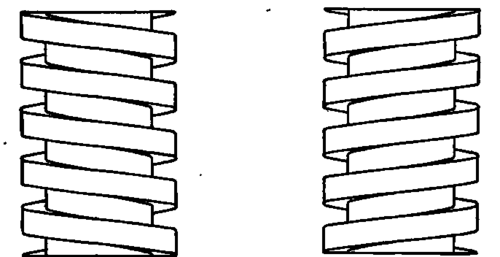

[Bike Maintenance Class:](Bike_Maintenance_Class) Week 1,
Introduction and Flat Repair

## Component Identification and Basic Terminology {#component_identification_and_basic_terminology}

### What's What on a Bike {#whats_what_on_a_bike}

\

### Drive Side and Non-drive Side {#drive_side_and_non_drive_side}

The right side of the bike is referred to as the drive side while the
left side is the non-drive side.

### How to talk about gearing {#how_to_talk_about_gearing}

Gears closer to the frame are referred to as *inner* gears while the
ones furthest from the frame are the *outer* gears. High and low in
relation to the gears describes the relative mechanical advantage of the
gearing. An easy mnemonic for this is **H**igher gears are **h**arder
while lower gears are easier. The inner gears on a bike are always going
to be the lower gears and the outer gears are the higher gears.

### Right-hand vs Left-hand Threading {#right_hand_vs_left_hand_threading}

Almost every threaded component on a bike is going to be right-hand
threaded, which means that turning it clockwise will tighten it and
turning it counter-clockwise will loosen it. Pedals and bottom bracket
cups are examples where you would run into left-hand threaded
components. To identify the *handedness* of a component hold it in front
of you as in the picture below. The direction that the threads slant up
too corresponds to the components handedness.

Left-handed Right-handed

### Valves: Schrader and Presta {#valves_schrader_and_presta}

The two types of valves you will see on 99% of bikes in America are
schrader and presta. Schrader valves are the same type of valve that you
see on cars and most other pneumatic tires. Presta valves are 

## Basic Upkeep {#basic_upkeep}

### Inflating Tires {#inflating_tires}

### Cleaning and lubing the chain {#cleaning_and_lubing_the_chain}

## Flat Repair {#flat_repair}

-   Understanding brake and wheel quick release mechanisims
-   How to remove a tire with tirelevers
-   Identifying puncture source (don't forget to keep everything lined
    up!)
-   Patching

## Hands On {#hands_on}

Repairing flat tires on demo wheels.

## **Resources**

More than you really need to know about flats: [Sheldon Brown Tells
All](http://www.sheldonbrown.com/flats.html)

[Category:Bike_Maintenance_Class](Category:Bike_Maintenance_Class)
