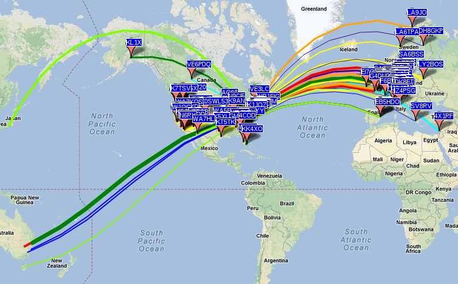

{width="500"} HacDC's Radio
Station Also documented at <http://www.w3hac.org/our-station/> .

-   [Icom
    FT-718](http://www.icomamerica.com/en/downloads/Default.aspx?Category=20)

```{=html}
<!-- -->
```
-   Micom 2TS Transceiver w/ALE

```{=html}
<!-- -->
```
-   Rooftop 20m vertical antenna
    [antenna](http://www.hacdc.org/2012/08/new-amateur-radio-antenna/)
    with [SGC-237 automatic
    tuner](http://www.sgcworld.com/237ProductPage.html). Coverage from
    160m to 10m legally including CB.

```{=html}
<!-- -->
```
-   [Sound_Card_Interface](Sound_Card_Interface)

```{=html}
<!-- -->
```
-   [Ham Radio Deluxe](http://www.ham-radio-deluxe.com/)

```{=html}
<!-- -->
```
-   [WSPR Net - Weak Signal Propagation Reporter
    Network](http://wsprnet.org)

```{=mediawiki}
{{Template:Amateur Radio}}
```
[Category:Equipment](Category:Equipment)
