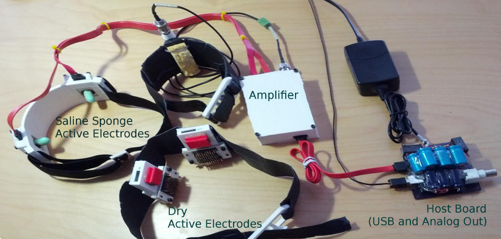
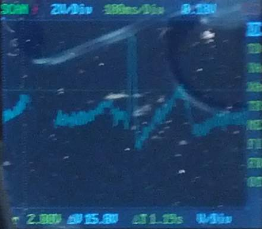

# Status

Operational. Use the dry (gold pin header) electrodes for now, saline
electrodes will be sealed in hot glue soon.

# Usage

1.  Connect the USB port to a computer with the
    [BiosignalProcessor](http://mirage335-site.member.hacdc.org:6380/wiki/Category:BiosignalProcessor)
    software installed. Primarily, this software depends on
    [libsndfile](http://www.mega-nerd.com/libsndfile/) and
    [baudline](http://www.baudline.com/).
2.  Launch the
    [BiosignalProcessor](http://mirage335-site.member.hacdc.org:6380/wiki/Category:BiosignalProcessor)
    software. Noise floor should be approximately -100dB.
3.  All sponge electrodes need to be wet, preferably with saline. This
    includes the reference electrode with a large yellow sponge, and the
    green sponge electrodes.
4.  Connect the SATA data cables as shown in the photo. These are
    actually used as shielded carriers for power and analog signals.
5.  Plug in the 12V wall wart. This enables the medically isolated RECOM
    RS-1212D power supplies.
6.  Noise floor should now be approximately -80dB.
7.  Cautiously, connect yourself to the Biosignal Amplifier. The BNC
    connectorized yellow sponge electrode is a reference, and may be
    connected anywhere on the body, preferably the right leg for
    electrocardiography, or arm for electroencephalography. The other
    two electrodes pickup the actual signal, and should be placed near
    the signal source.

# Signal Sources {#signal_sources}

The pickup electrodes (either the green sponges and headband or dry pin
header based electrodes) may be placed at a variety of locations to
obtain biosignals in realtime.

-   Placing the electrodes hand-to-hand or across the chest should
    obtain clear, strong electrocardiography (ECG, heartbeat) signals.
-   With eyes closed, and pickup electrodes on the back of the head,
    four out of five participants will show an approximately 10Hz alpha
    rhythm, usually above -60dB on the chart.
-   Across the forehead, electrooculography (EOG, eye movement) signals
    become dominant.
-   Across any major contracted muscle (eg. forearm), random noise will
    be observed. This is an electromyography (EMG, muscle activity)
    signal.
-   While sleeping, delta rhythms should appear at 90 minute intervals
    across the parietal (top of the head) and frontal (forehead) lobes.
    This has yet to be experimentally verified.

# Captured Data Samples {#captured_data_samples}

## Heartbeat

Captured on a [DSO Nano](https://www.sparkfun.com/products/11702)
oscilloscope from the analog (BNC) output.

## Alpha Rhythm {#alpha_rhythm}

Alpha waves (EEG brainwaves) captured from occipital lobe with eyes
closed. USB output was used directly. Notice the \~10Hz signal.

Low-frequency noise to the left is expected to go away when a better
transformer is used, or electrodes are better positioned.

# Assistance

Drop by [HacDC's IRC channel](irc://irc.freenode.net/hacdc) and ping
mirage335 .

# Troubleshooting

-   The older dry active electrodes, based on gold plated pin headers,
    are somewhat easier to use than the green saline sponge electrodes.
    However, they require significant pressure to function properly,
    particularly for EEG use, which some users find uncomfortable.
-   When in doubt, look for an electrocardiograph (ECG heartbeat)
    signal. Heartbeats are among the most available, strongest, clearest
    indicators of a working biosignal amplifier.
-   The BNC analog output on the host board is designed for connection
    to an oscilloscope.
-   Signal overload will trigger the green LED on the host board to
    flash.
-   HacDC has a
    [BiosignalSimulator](http://mirage335-site.member.hacdc.org:6380/wiki/BiosignalSimulator)
    on the test cart, which generates synthetic common-mode and
    differential-mode signals.

# Safety

Reasonable safety features have been included. However, there are still
some things to be aware of:

-   Just 1mA of current for 1ms across the heart is most likely to be
    fatal. Take no chances.
-   DO NOT operate high-power RADIO equipment (ie. our amateur radio
    station) while connected to the BiosignalAmplifier. High frequency
    radio transmissions will penetrate the isolation amplifier, which is
    to say you are an RF ground.
-   DO NOT connect to external power in bad weather. Nearby lightning
    strikes will penetrate the isolation amplifier, and HacDC is not
    known to have excellent power quality.
-   Excessive saline might contact the power supply rails in the active
    electrodes if the sealant has broken down. If in doubt, check the
    electrodes for voltage with a multimeter before using. Anything
    above 0.6V indicates a fault has occurred.
-   Try not to leave any of the SATA cables partially connected while
    the system is on. In theory, the system might be damaged if just one
    or two of the supply rails (Vcc, GND, or Vee) are disconnected.
-   No claim of liability is made by anyone. Your accident is your
    accident. Use common sense. If you don't understand the safety
    features and limitations, don't use this circuit.

# Cost

Total cost of replacement is \~\$300 and \~60 hours. Please don't break
our BiosignalAmplifier!

# Lending Policy {#lending_policy}

Qualified HacDC members are invited to borrow the BiosignalAmplifier,
particularly for sleep research. Please update the status section when
borrowing. Also be careful to keep all safety concerns in mind.

# Credit

Design is by mirage335. Credit to HacDC and its biohacking community for
electronics testing and construction equipment. Additionally, special
thanks to the following for enthusiasm and prototype funding:

-   Shawn Nock
-   Sharad Satsangi
-   Stuart Washington
-   The Real Plato
-   Logan Scheel

# OpenSource

Complete schematics, PCBs, BOMs, 3D printable enclosures, firmware, USB
driver software, and documentation hosted on github:
<https://github.com/mirage335/Mirage335BiosignalAmp>
<https://github.com/mirage335/BiosignalProcessor>

Additional documentation available on the project's webpage at:
<http://mirage335-site.member.hacdc.org:6380/wiki/Mirage335BiosignalAmp>

## Copyleft

Mirage335BiosignalAmp is Copyright (C) 2012 mirage335 under the FSF
GPLv3. Schematic images are part of Mirage335BiosignalAmp.

See license.txt for Mirage335BiosignalAmp license conditions.

# Future Improvements {#future_improvements}

-   Host board enclosure wasn't quite the right size. Once that is
    reprinted, all components should be in nice strong 3D printed cases.
-   Surprisingly, saline seems to have leaked into the sponge based
    active electrodes, possibly due to cracking of certain plastic
    interfaces. PCBs will be cleaned, sealed in hot-glue, and the
    enclosures will be repaired this weekend. In the meantime, the dry
    electrodes work well as always.
-   Autocorrelation functions would be useful in the BiosignalProcessor
    software for identifying Event Related Potentials.

# Alternatives

HacDC does have three neurosky headsets. Unfortunately, these do not
seem to perform well with their built-in dry electrodes. Impedance has
been measured at around 3 megaohms.

Texas Instruments supplied HacDC with an ADS1299 EEG biosignal amplifier
system-on-a-chip. This device may be within half the performance of this
Biosignal Amplifier, offering more channels and greater convenience.
Further, the new [OpenBCI](http://www.openbci.com/) platform, perhaps
the only other decent EEG system worth using, is based on that chip.

[Category:Equipment](Category:Equipment)
