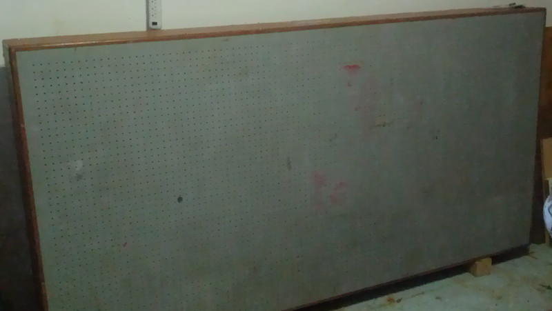

{width="500"}

HacDC's Optical Table

# Status

Operational, standing on pneumatic legs.

Optical and mechanical hardware in progress. Gantry is planned to enable
ultra high-accuracy and wide area CNC milling, laser cutting, and 3D
printing.

# Specifications

Not known with certainty, some estimations follow:

-   Rigidity sufficient for safe mechanical use.
-   Tapped holes.
-   Steel surface, epoxy/metal honeycomb base.
-   Can be kept level to within \~15nm.
-   Heavy - 800 pounds (350kg).
-   Pneumatic mounting.

# Associated Equipment {#associated_equipment}

-   Big (\~40x40mm) aluminum extrusions, sufficient to equip entire
    table with a gantry.
-   Lens and mirror mounts.
-   Wide variety of optical elements, lenses, mirrors, beam splitters,
    fibers, telescope, microscope, etc.
-   Micro-manipulators.
-   Lasers.
-   High voltage (up to 6kW) power supplies.

# Safety

High voltage power supplies and powerful lasers are dangerous, with a
lot of subtle "gotchas". Don't play with them unless highly experienced.

[Category:Equipment](Category:Equipment)
