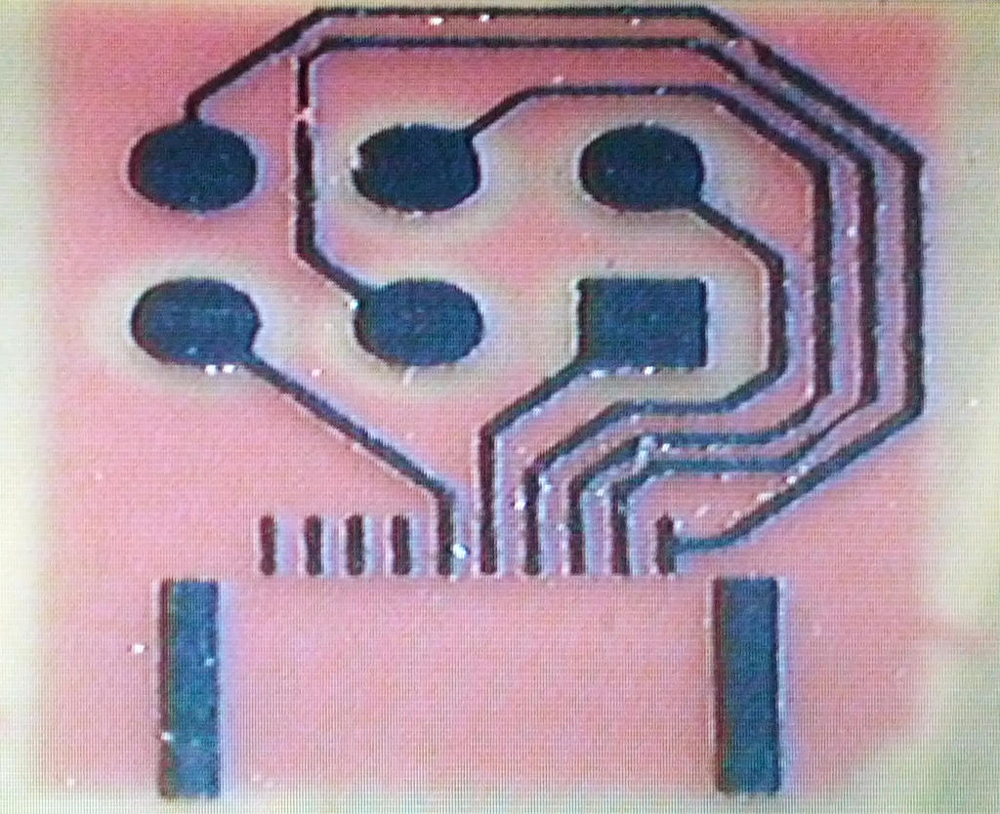
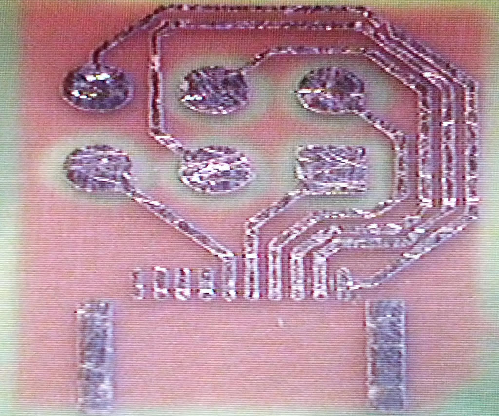

{width="500"}

When the 10mil isolation paths offered by CNC Milling are insufficient,
photolithography becomes the PCB fabrication method of choice.

# Large Boards {#large_boards}

For large boards, note the following:

-   Foam backing will be needed to press the PCB evenly against a
    photomask. Otherwise, acrylic (and similar) frames may bubble under
    pressure, allowing the photomask to 'pop-up' in the middle.
-   During chemical processing, alternate between photodeveloper and
    etchant. Proceed with etchant only when all exposed regions are
    changing color. Otherwise, problems with ultrathin photoresist
    residue may remain.
-   Avoid placing UV light sources in extreme proximity to the board.
    Doing so may unevenly expose some regions.

# PCB Design {#pcb_design}

Recommend gEDA. Project template with CNC Mill and gerber export scripts
available on [github](https://github.com/mirage335/gEDA_Template).
Photolithography scripts are specifically provided at
[hacdcPhotoLithography
subfolder](https://github.com/mirage335/gedaProduction/tree/master/hacdcPhotoLithography)
of the [gedaProduction
repository](https://github.com/mirage335/gedaProduction).

# Design Rules {#design_rules}

Recommend at least the following tolerances:

-   6 mil (0.15mm) feature size (traces and spacing)
-   34 mil (0.85mm) hole size with 8 mil (0.21mm) annular ring size
    (50mil/1.25mm outside diameter) - fits most through-hole components,
    standardization on one size obviates manual milling bit swapping
-   25 mil minimum hole size - tested for milldrilling

For comparison, [oshpark](http://oshpark.com/pricing) offers:

> The minimum specs for 2 layer orders are 6 mil traces with 6 mil
> spacing, and 13 mil drills with 7 mil annular rings.

Recommend most traces be kept to 10mil width, especially long traces.
Note slightly better resolution is routinely feasible with practice.

# Process

Simple, consisting of:

1.  Photosensitive copper clad board. If not already available, more can
    be made by laminating dry film photoresist to bare copper clad
    board.
2.  Via/hole drilling, outline milling, etc. Best done automatically on
    CNC mill. Please be careful to terminate outline cutting once
    complete, do not allow the endmill to bind.
3.  Photomask. Printed on transparencies at high-resolution. Inkjet
    printers, \>600dpi, do well, given true inkjet transparencies. Some
    laser printers may require double layer photomasks. Alternatively,
    \<445nm lasers may be able to selectively expose the photoresist.
4.  UV exposure. Sunlight or high-brightness CFL bulbs can expose the
    photoresist in \~5-30 minutes. EEPROM eraser boxes with timers are
    best. Even exposure is critical, and timing is critical for
    lower-contrast photomasks.
5.  Development. Use a foam brush with the appropriate developer
    solution from the chemicals shelf. Alternatively, a warm bath can
    quickly provide better consistency across large boards, particularly
    if photodeveloper includes silicate.
6.  Etching. Recommend a sponge with ferric chloride to remove exposed
    copper. This is quicker and less wasteful than the "bath" process.
7.  Carefully repeat above two steps as necessary to isolate all traces.
8.  Striping. Sodium hydroxide completely removes photoresist. May need
    additional UV exposure.
9.  Solder mask. Optional. Laminate two dry film photoresist sheets onto
    the PCB, apply photomask, expose, and develop. Alternatively, laser
    cut a negative solder mask from blue tape, and apply
    high-temperature spraypaint.

# Assembly

For large boards with hundreds of components, reflow can be quicker than
manual soldering.

1.  Laser cut solder paste stencil from blue tape. Apply stencil to PCB.
2.  Add smooth, paper thin layer of solder paste with a razor.
3.  Remove stencil.
4.  Place components on the appropriate pads.
5.  Carefully melt the solder with the hot-air reflow tool. Hold the
    hot-air tool close to the components at 400C and maximum airflow,
    watch carefully, and progressively move the tool across the board as
    solder melts.

Note that this process is somewhat incompatible with hand-soldered vias.

# Resources

HacDC has the requisite resources:

-   Permanently installed workroom incandescent safe light.
-   Flourescent light array exposure lamp.
-   Modified EEPROM exposure box including timer, germicidal lamp, foam
    backing, and laser-cut acrylic PCB/photomask holding jig.
-   Standalone polycarbonate and acrylic PCB/photomask holding jigs, for
    use with alternative light sources.
-   Laser printer.
-   Transparencies.
-   Positive photosensitive copper clad board (typically including
    590-660).
-   Negative photosensitive copper clad board.
-   Negative dry film photoresist.
-   Bare copper clad board, various types and thicknesses.
-   Various photodeveloper chemicals. Use the positive developer
    solution and foam brush for positive resists, sodium carbonate
    (washing soda) for negative resists.
-   Lots of copper dissolving etchant, various types, some good, some
    bad.
-   CNC Mill.
-   A heated and bubbled etchant bath has been constructed by mirage335.
    While reasonably quick (\~15 minutes) and consistent, this is not
    recommended, as components degrade quickly, and the resulting acid
    vapor is extremely harsh.

# Demo

Chemically developed and etched PCB. Photoresist remaining.
{width="500"}

Photoresist stripped, bare copper PCB electrically tested.
{width="500"}

Aligned reverse side.
{width="500"}

# Safety

Please be careful with the chemicals, most of which are strong acids or
bases. Strictly avoid contact and vapors. Nitrile gloves are available.
Immediately rinse and move to fresh air after any accidental contact.

Generally, the most hazardous operations involve the etchant bath, and
preparing fresh photodeveloper. The actual PCB fabrication process
itself, applying an etchant bottle to a sponge and using non-concentrate
photodeveloper, is relatively simple.

# Reference

<http://www.instructables.com/id/Killer-PCBs/>
<http://www.mgchemicals.com/downloads/pdf/negativePrototyping.pdf>
<http://www.instructables.com/id/Sponge-Ferric-Chloride-Method-Etch-Circuit-Bo/>

# Credit

Many thanks to:

-   Dan Barlow

# Research Underway {#research_underway}

-   Better photodeveloper. The MG Chemicals product works reasonably
    well thus far, but may not include sodium silicate.
    [http://www.electricstuff.co.uk/pcbs.html
    Reportedly](http://www.electricstuff.co.uk/pcbs.html_Reportedly)
    RS-Components 690-849 is far superior, allowing development in
    seconds with lower risks of overdevelopment.
-   Alternative photoresist, as reported at
    [1](http://www.electricstuff.co.uk/pcbs.html).
-   DLP projector maskless lithography.
-   Tracing paper photomasks, as reported at
    [2](http://www.electricstuff.co.uk/pcbs.html).
-   Polyester drafting film, as reported at
    [3](http://www.amazon.co.uk/dp/B00378TP12/?tag=-af-21#customerReviews).
-   Official MG Chemicals photomask transparency sheets -
    [4](http://www.mgchemicals.com/products/prototyping-and-circuit-repair/prototyping/transparency-film-416-t/)
    .
-   Professionally printed or phototypeset photomask (perhaps kinkos
    does this).
-   PCB processing spray tanks for developing and etching. Expected to
    improve quality and ease of use, allowing higher yields and more
    attempts as necessary.
-   CircuitWriter repair pen to repair scratched or undercut traces.
-   Conductive ink, rivet
    (http://www.megauk.com/through_hole_rivets.php), or 'bar'
    (http://www.technick.net/public/code/cp_dpage.php?aiocp_dp=guide_pcb)
    through-hole connections. Apparently, the rivets can be used without
    the expensive punch tool (http://www.electricstuff.co.uk/pcbs.html).
-   Spray on photoresist, for repeat exposures. Quality results with
    spray resists have been reported at
    <http://www.marwynandjohn.org.uk/GM8OTI/projopticalpcb/projopticalpcb.html>
    .

## Full-Scale Process {#full_scale_process}

Professional PCB fabs manufacture upwards of dozens of PCBs per hour,
with resulting boards ready for rapid solderpaste stencil based PCB
assembly. Efforts are underway to implement required DLP projection and
spray tank equipment for at least part of this process, a description of
which follows:

### Dual-Layer Boards {#dual_layer_boards}

#### Templates

1.  Positive presensitzed board, negative artwork (dark regions cover
    desired copper).
2.  Predrilling if dual pre-aligned DLP projection is not available.
3.  UV **photoexposure**, high contrast, using DLP projection.

#### Photo-Patterning {#photo_patterning}

1.  Warm **photodevelopment** bath (exposes desired copper).
2.  **Rinse** spray (pH should be neutral -\<1.5).

#### Processing

1.  Via/hole **drilling**, if not done already.
2.  **Conductive coating**, to activate through-holes
    (http://www.thinktink.com/stack/volumes/volvi/condink.htm).
3.  Recirculated **electroplating** bath (adds copper everywhere,
    including holes). Requires specialized copper plating solution
    (http://www.thinktink.com/stack/volumes/voliii/consumbl/cplatmix.htm)
    .
4.  Liquid **tin plating** (simple bath, no spraying) covers everything
    with tin, which resists etchant.
5.  **Photoresist stripping** with concentrated sodium hydroxide.
6.  **Etching** spray removes bare copper, leaves previously tinplated
    surfaces unharmed.
7.  **Rinse** spray (pH should be neutral -\<1.5).
8.  **Tin stripping** spray
    (http://www.alliedelec.com/search/productdetail.aspx?SKU=70125740)
    leaves bare copper.
9.  **Rinse** spray (pH should be neutral -\<1.5).

### Multilayer Boards {#multilayer_boards}

Similar to dual-layer boards. However, interior layers are processed
first as two sided PCBs, with exterior processing and through-hole
plating taking place after inter-layer bonding. Preferably, drilling
also takes place after inter-layer bonding.

#### Templates {#templates_1}

1.  Positive presensitzed board, negative artwork (dark regions cover
    desired copper), *single-sided for exterior layers*, *double-sided
    for interior layers*.
2.  Predrill registration holes in panel corners. In additional to
    presensitized board, pre-preg should also be predrilled.
3.  Predrill all holes if dual pre-aligned DLP projection is not
    available. In additional to presensitized board, pre-preg should
    also be predrilled. Beware separately predrilled layers may fail to
    electrically connect in multilayer boards.

#### Photo-Patterning (All Layers) {#photo_patterning_all_layers}

1.  UV **photoexposure**, high contrast, using DLP projection.
2.  Warm **photodevelopment** bath (exposes desired copper).
3.  **Rinse** spray (pH should be neutral -\<1.5).

All layers should now have correctly developed/patterned photoresist on
bare thin copper.

#### Interior Processing {#interior_processing}

1.  Recirculated **electroplating** bath (adds copper everywhere, except
    holes). Requires specialized copper plating solution
    (http://www.thinktink.com/stack/volumes/voliii/consumbl/cplatmix.htm)
    .
2.  Liquid **tin plating** (simple bath, no spraying) covers everything
    with tin, which resists etchant.
3.  **Photoresist stripping** with concentrated sodium hydroxide.
4.  **Etching** spray removes bare copper, leaves previously tinplated
    surfaces unharmed.
5.  **Rinse** spray (pH should be neutral -\<1.5).
6.  **Tin stripping** spray
    (http://www.alliedelec.com/search/productdetail.aspx?SKU=70125740)
    leaves bare copper.
7.  **Rinse** spray (pH should be neutral -\<1.5).

Interior layers should now be fully processed, down to thick patterned
copper.

#### Bonding

1.  **Bond** stack with heated press and adhesive (ideally pre-preg).

Completed interior layers are now buried, with exterior layers still
holding developed/patterned photoresist on bare thin copper.

#### Exterior Layers & Through-Holes {#exterior_layers_through_holes}

1.  Via/hole **drilling**, ideally now instead of predrilling.
2.  **Conductive coating**, to activate through-holes
    (http://www.thinktink.com/stack/volumes/volvi/condink.htm).
3.  Recirculated **electroplating** bath (adds copper everywhere,
    especially holes). Requires specialized copper plating solution
    (http://www.thinktink.com/stack/volumes/voliii/consumbl/cplatmix.htm)
    .
4.  Liquid **tin plating** (simple bath, no spraying) covers everything
    with tin, which resists etchant.
5.  **Etching** spray removes bare copper, leaves previously tinplated
    surfaces unharmed.
6.  **Rinse** spray (pH should be neutral -\<1.5).
7.  **Tin stripping** spray
    (http://www.alliedelec.com/search/productdetail.aspx?SKU=70125740)
    leaves bare copper.
8.  **Rinse** spray (pH should be neutral -\<1.5).

Exterior layers should now be fully processed, down to thick patterned
copper. Through-holes should have been plated along with exterior
layers. Interior layers are completed, with via copper edges adjoining
the through-hole plating. Tin plating should have protected the
through-holes and associated copper joints.

At this point, the multilayer board should be physically and
electrically flawless, ready for high-temperature soldering.

### Soldermask

Completely optional, but easy with the tools and supplies within arm's
reach. Laminate top and bottom copper with two layers of dry film
resist, photoexpose, and develop.

### Expensive Components {#expensive_components}

-   3 \* \$90 - SHURflo Industrial Pump Model #2088-594-154 114V
    Corrosion Resistant Pumps (Electroplating, etching, tin stripping
    spray tanks). Don't bother looking for another pump, this one has
    actually been used in an etchant sprayer system, and can be expected
    to survive the extremely harsh chemicals.
-   4 \* \$15 - [Specialized
    Heater](http://www.ebay.com/itm/1x-KINSTEN-Etching-Plating-Heater-EPH-20-300W-110V-Taiwan-/170942808453?pt=LH_DefaultDomain_0&hash=item27ccfc4185&afsrc=1)
    (Photodevelopment bath, electroplating, etching, tin stripping spray
    tanks).
-   36 \* \$2 - Toro 3GPH Mister
-   2 \* \~\$150 DLP Projector

Minimum cost to implement the full system is therefore around \$700, a
\$1k budget is probably reasonable. Better projectors may be worth
investing in, to ensure highly successful fabrication results are
achieved.

Higher resolution, lower-cost microscopic projection systems for
mounting on RepRap type machines are also underway.

### Environmental Concerns {#environmental_concerns}

Cupric Chloride (typically the green stuff) should be used as the
etchant, as it can be recharged completely with atmospheric oxygen and
hydrochloric acid. However, Ferric Chloride should be used initially, as
it performs better with less tendency to 'grow'.

[Category:Equipment](Category:Equipment)
