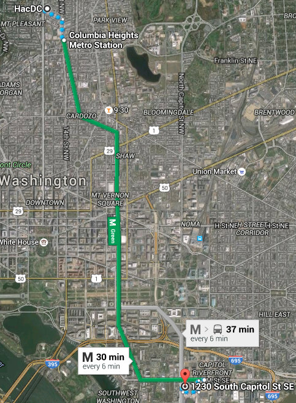

# Candidates

## Local

### 1230 S Capitol Street SE, Washington, DC 20003 {#s_capitol_street_se_washington_dc_20003}

{width="200"}

Metro accessible, simple route and easy walk. Upstairs access by
elevator. \$221/mo 10' x 15' \$185/mo 10' x 10'

### 2308 Chillum Road, Hyattsville, MD 20782 {#chillum_road_hyattsville_md_20782}

Metro accessible before dark ('trail' officially closes after dark).
Upstairs access by elevator. \$206/mo 10' x 15' \$135/mo 10' x 10'

# Reference

-   <https://www.sparefoot.com/search.html?searchType=storage&location_id=&location=20010%20Washington,%20DC&latitude=&longitude=&distance=15&zoom=&moveInDate=&moveInDatePlusMinus=&moveInDateUnsure=&sqft=&amenities=&order=0&page=1&show=30&useLocation=>
-   <https://www.publicstorage.com/storage-search-landing.aspx?location=%2020010&pid=wgoogseo&CID=8015>
-   <https://www.cubesmart.com/district-of-columbia-self-storage/washington-dc-self-storage/>
-   <http://www.extraspace.com/Storage/Facilities/US/District_of_Columbia/Washington/501874/Facility2.aspx>
-   <http://www.u-store.com/p/self_storage/sizes_prices_826/washington-dc-20002/ustore-self-storage-washington-826>
-   <http://www.uhaul.com/Storage/Washington-DC-20010/Results/>

[Category:RealEstate](Category:RealEstate)
