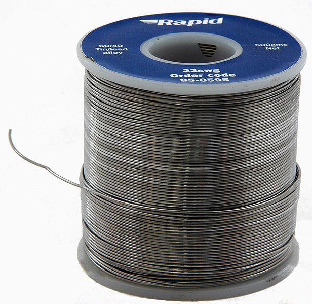
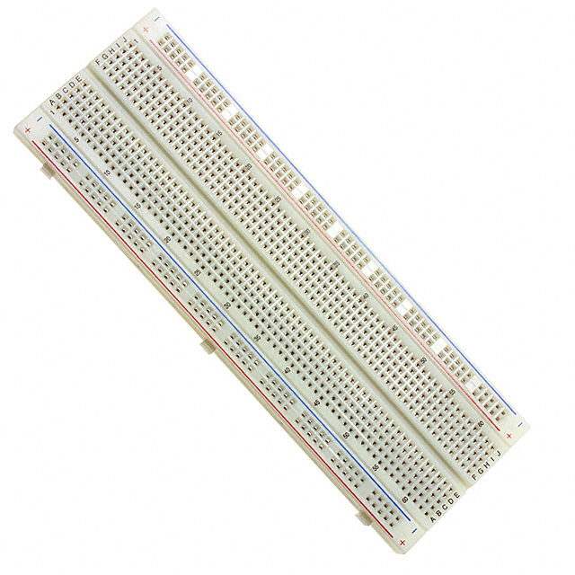

# Electronics Class {#electronics_class}

This class is targeted at the beginner who wants to learn electronics.
It would make a fine prerequisite to the [Microcontroller
Course](Microcontroller_Course) or the
[HAMClass](HAMClass)

### tease

These images form a slide show and a gestalt introduction to
electronics. In which we map the techniques available to hackers and
their surrounding requisite building blocks.

-   [http://wiki.hacdc.org/images/8/82/Mindmap.jpgmindmap](http://wiki.hacdc.org/images/8/82/Mindmap.jpg)

My hacking started with music and production. it wasn't exacly the tech;
more for the ride.

-   <http://wiki.hacdc.org/images/5/5c/Wmuc_main.jpg> WMUC main studio

Complicated behaviour arises from iteration of simple models. Learning
how to operate something like this is simpler and more subtle than it
looks.

-   <http://wiki.hacdc.org/images/thumb/9/99/Wheatstone.jpg/800px-Wheatstone.jpg>
    wheatstone broadcast console

Easier to see is block diagram form; a gestural view of a complex
system. WMUC recording suites and broadcast control rooms. Computing.

-   <http://wiki.hacdc.org/images/b/b9/Mixerschem.png> signal diagram

Why study DC/baseband/RF electronics; anachronism?

-   <http://wiki.hacdc.org/images/a/a3/Roofchill.png> chill on the roof.

Space shuttle shots; APRS , RACES, field day. Social technical effects
require proficiency.

-   <http://wiki.hacdc.org/images/e/ea/W3eaxtower.png> W3EAX tower

Small systems scale into big ones. 40,000 people at Operation ceasefire
(united for peace& justice) '05 at the national mall. Standing between
SS, Park police and thousands of protesters.

-   <http://wiki.hacdc.org/images/d/d7/Ceasefirestage.jpeg> ceasefire
    stage
-   <http://wiki.hacdc.org/images/3/30/Ceasefirecrowd.jpeg> ceasefire
    40k

No always smooth sailing.

-   <http://images.spaceref.com/news/2003/09.06.03.noaa-n.med.jpg> mars
    needs bolts

Building whimsey.

-   <http://wiki.hacdc.org/images/b/bf/Dancepanel.jpeg> lightup dance
    floor

Computer control over physical objects. microcontrollers + christmas
tree lights.

-   <http://wiki.hacdc.org/images/f/f3/Dancectll.jpeg> dance floor
    controller

Not always smooth. Electrical compatibility != political compatability

-   <http://wiki.hacdc.org/images/2/2c/Hhr.png> hhr - phear the
    transaxle

More small systems iterated.

-   <http://wiki.hacdc.org/images/c/cc/Igniterschem.jpeg> fireworks
    diagram

DIY Ignition source in Berlin. in a pinch you don't need a parts
catalog.

-   <http://wiki.hacdc.org/images/9/91/Igniterface.jpeg> igniter
    controller

Apologies to Dakami

-   <http://wiki.hacdc.org/images/d/d1/Fireworkscrates.jpeg> fireworks
    crates

Simple systems, RC control, Robots and igniters.

-   <http://2.bp.blogspot.com/_KqHQ-3WDqyk/SFqH25qqRwI/AAAAAAAAAS0/sJ2S8ppcBWQ/s1600-h/1055943372_295788412e.jpg>
    wm greek fire

Recently robotics have become accessible to experimenters. Bluto cuts,
welds and hugs.

-   <http://wiki.hacdc.org/images/4/47/Cadfab.jpg> Welding robots!

## Required Materials {#required_materials}

(see also: our [Suppliers page](Suppliers))\
----
{width="200"}{width="200"}

-   Multimeter \$4
    -   [Source: Harbor
        Freight](http://www.harborfreight.com/7-function-digital-multimeter-92020.html)

------------------------------------------------------------------------

{width="200"}

-   Soldering Iron (25-30w) \$10
    -   [Source: Harbor
        Freight](http://www.harborfreight.com/30-watt-120-volt-soldering-iron-47887.html)

------------------------------------------------------------------------

{width="200"}

-   Solder ( 22ga )
    -   [Source: Harbor
        Freight](http://www.harborfreight.com/lead-free-rosin-core-solder-95861.html)
    -   [Source: Radio
        Shack](http://www.radioshack.com/product/index.jsp?productId=2062712)
    -   Or ANYWHERE, really.

------------------------------------------------------------------------

{width="200"}

-   Bread Board ( or [AshClassBoard](AshClassBoard) ) \$10
    -   [Source:
        Mouser](http://mouser.com/ProductDetail/BusBoard-Prototype-Systems/BB400/?qs=sGAEpiMZZMskUkxWo/qA8g6E2/%252b0L/2p)
    -   [Source:
        Digi-Key](http://search.digikey.com/scripts/DkSearch/dksus.dll?Detail&name=438-1045-ND)

------------------------------------------------------------------------

-   wire 24ga

------------------------------------------------------------------------

-   30ga solid core wire

------------------------------------------------------------------------

-   Resistors 10kohm

------------------------------------------------------------------------

-   variable resistor 10kohm linear \$1

------------------------------------------------------------------------

-   switch
    <http://www.mouser.com/search/ProductDetail.aspx?qs=JTMHOUw%252b%2fhkyoxmWRloCXw%3d%3d>

------------------------------------------------------------------------

-   leds (various)

------------------------------------------------------------------------

-   capacitor 470uf (ish)
    <http://www.mouser.com/Search/ProductDetail.aspx?qs=Dj1PTMaP5uJBsuYHd%252b9oGQ%3d%3d>

------------------------------------------------------------------------

-   pn2222 transistor \$.03

------------------------------------------------------------------------

-   1/8 male phono jack

`Read The Fine Data Sheet:  They hide secrets in the documentation.`

## Metering

`There are many like it but this one is mine.`

-   Naming of parts
-   Should be a VOM - Volt Ohm Meter
    -   metering modes
        -   restistance - Ohms of resistance
        -   voltage - Volts
        -   Current - Amps/Milliamps - check the leads
        -   diode check - see \[Diodes\]
    -   leads - plugged into the right ports?
-   Continuity testing
    -   set the meter to the lowest resistance mode (200ohms or auto
        resistance)
    -   or perhaps Diode check; or even beeping
    -   reads "off scale" when the leads are unconnected, this is an
        open circuit
    -   firmly touch leads together -loopback test
    -   reads near 0 if the leads are crossed
-   Voltage testing
    -   set meter to 20Vdc or VautoDC
    -   touch leads to metered points
    -   the reading on the meter is the difference in voltages between
        the leads
    -   Try AC mains!! - safety second.

#### SwitchLab

-   use the continuity meter to diagram the electrical layout of the
    switch.
-   solder switch to the board.
-   test under power with meter voltage setting

## Relays/Switches

Codespeak

-   SPDT - single pole dual throw
-   DPST - dual pole single throw
-   4P10T - ???

`- Map this mystery switchLab`

## Wire

The basic wire is a pipe through which electrons can flow from the
lowest voltage side to the highest ([conventional
current](wikipedia:Electric_current#Conventional_current)) up
to the physical limits of the wire.

-   Condunctor vs. Insulators
-   Current limit via wire gauge
    [1](http://www.powerstream.com/Wire_Size.htm)
-   Voltage limit via insulation.
-   Magnetic and Electric fields surround an energized wire (what?!)
-   And wire will respond with current when moved through magnetic flux
    -   bass pickups
    -   Lentz law
    -   Siemens, mho, ohms
-   strip wire
-   and don't nick the conductor

## Electromagnetics

-   Einstein's "spukhafte Fernwirkung"
-   Quantum Electrodynamics
    -   Electron and photons interact - somehow
-   Gauss, Maxwell and
-   Permanent magnets useful - locked domains
    -   Ferro materials, Ni, Co, Sr, Rb, Nb, Nd, Cr and Fe.
    -   Except when they aren't - curie temperature.
-   Hall effect - sensing - spaceship drives
-   Motors, linear, rotary, vibrational, direct ( magnetohydrodynamic)
-   Radios
    -   EM probe demo
    -   EM spectrum
        -   DC, ELF, SLF (submarines, blue whales), AF, LF,HF, (Short
            wave), VHF, UHF, Microwave, weird stuff, gamma rays (the
            incredible hulk, gian ants).

## Soldering

`Hold the cold end.`

Soldering ( for our purposes ) is the process of joining electrical
contacts with a low melting point metal to make a mechanically and
electrically strong connection.

-   Restrain long hair/clothing/jewelry.
-   Clean both parts of waxes, oils or debris.
    -   Ethanol/Methanol/SLX
    -   Flux/Rosin/Dry
-   Mechanically fit connections together
-   Clean and wet the iron
    -   Tip should be immaculate and bright
-   Heat both parts until hot
    -   Cheat, use another heating element
        -   quartz floodlight, sterno, propane or mean stare.
    -   but not too hot - see blue smoke lab
-   Apply just enough solder to wet the contact surfaces
-   Wait for the connection to shine smoothly
-   remove the iron an test the connection
    -   yes it's hot stupid.
    -   the meter should find near 0 ohms of resistance between the two
        parts even when mechanically stressed.
    -   the meter should read "off scale" to everything that should be
        isolated
-   Splice practice
    -   Western Union Splice
    -   Pigtail Splice

## Speakermaking lab {#speakermaking_lab}

materials:

-   junk wire, lots of it
-   magnet ( stronger is better )

Test stuff:

-   multimeter
-   signal generator, (or music source)
-   power amp

Construction:

-   Make coil of wire 24ga 1" dia, 50-400 turns.
    -   use a form, marker, tp tube, pvc pipe
    -   Measure impedance \> 1.5 ohm
-   Stick coil of wire to diaphram
-   Make stator/armature
    -   stick magnet to something - not too ferrous
-   stick diaphram near armature (correct axis??)
-   connect to amplifier; apply Rock!

Exercises for suckers:

-   Use the lentz law to calculate the force generated by thingy.
-   Why 8ohm speakers in the house?

## Resistor

`Not like the NYC variety`

Resistors impede the flow of electrons across them; usually to protect
components from excessive current.

-   [Ohm's law](wikipedia:Ohm's_law)
-   Diagonal IV curve.
-   symmetric

##### ResistorLab

-   solder resistors, meter and record;
-   compare to ohms law math

##### BlueSmokeLab

`Get this out of the way early (and often)`

-   turn off the switch
-   Solder the 30ga wire ends on to the lab 0 area
-   stow fingers away from wire
-   turn on switch

## Power

-   Measured in watts (usally)

`* .01w laser pointer`\
`* .25w cell phone`\
`* 1w `\
`* 15w car stereo`\
`* 25w soldering iron`\
`* 100w light bulb`\
`* 1500w hair dryer`\
`* 200 horsepower (750w/hp)`\
`* 3 tons of Air conditioner capacity (3.5kw/ton)`

-   The notion of instant work
-   Energy or work is expressed in joules (watt\*second). Or perhaps
    (Kw\*H)
-   Power(watts) = Current (Amps) \* Volts

`Electromechanical relay is a switch that's controlled electrically.`

### pros

-   Easy to design for
-   debugging (listen for satisfying click)
-   excelent isolation
-   high power control/\$

### cons

-   high drive current (mostly)
-   noisy (mostly)
-   slow
-   moving parts (eeew)

[a typical
relay](http://ecommas.tycoelectronics.com/commerce/DocumentDelivery/DDEController?Action=showdoc&DocId=Data+Sheet%7F1308242_T77%7F1104%7Fpdf%7FEnglish%7FENG_DS_1308242_T77_1104.pdf) -
map this mystery relay lab

#### Diode

##### ScaryDataSheetLab

-   a favorite led [2](http://www.vishay.com/docs/83012/83012.pdf)
-   LED ( Light emitting diode ) are diodes with a clear case.
-   electrons only permitted to flow in one direction: cathode to anode
    -   there are exceptions \[diode breakdown voltage\]
-   discontinuous IV curve
-   diode logic
-   the cathode is marked
-   the diode check function of the meter can reveal the correct
    polarity of a mystery diode with a suspect cathode mark.

## Light Emitting Diode {#light_emitting_diode}

-   the short lead is the cathode
-   LED's need current limiting (see
    [BlueSmokeLab](ElectronicsClass#BlueSmokeLab))

##### LEDLab

-   solder in 1kOhm resistor for the led , although you may use another
    if you can justify the value
-   Solder in the LED, with the short lead towards the ground.

## Motor

## Printed Circuits {#printed_circuits}

## Capacitor

`470μf electrolytic cap`

[wikipedia capacitor](http://en.wikipedia.org/wiki/Capacitor)
$\operator {work} (V) =
\frac {1}{2} 
2)Cv^2$ Hmm.. no teX support here.

#### Applications

-   Filters
    -   Decoupling - Ripple rejection
    -   Blocking - DC Bias rejection
    -   Use in networks - equalization networks
-   Storage
    -   Pump and dump - Photoflash.
    -   Tank application - DC - DC converters
-   Esoteric
    -   Sensors - Strain gauge
    -   Microphones - Old school
    -   nonlinear math - Calculating logs/exponents.

## Transistor

`PN2222 N channel transistor`\
`Elliot substitute-taught a class on transistor amplifiers...`\
`Notes in PDF are here:`\
[`Media:transistorLecture.pdf`](Media:transistorLecture.pdf)

### little amplifierlab {#little_amplifierlab}

-   class A amp
-   DC blocking caps
-   bias resistors
-   fixed gain
-   inverted waveform

### construction intro {#construction_intro}

-   breadboard intro
-   soldering intro
-   led circuit

## Digital Logic {#digital_logic}

-   AND C = A & B
-   OR C = A \| B
-   NOT C = !A
-   NOR C = !(A\|B)
-   NAND C = !(A&B)
-   MUX C = select A(n) based on B(n)

## IC

`LM386 Audio Amplifier `[`3`](http://www.national.com/mpf/LM/LM386.html)

# Links and class notes {#links_and_class_notes}

-   7-28
    -   [How bipolar junction transistors actually
        work](http://www.allaboutcircuits.com/vol_3/chpt_2/8.html)

[Category:Classes](Category:Classes)
