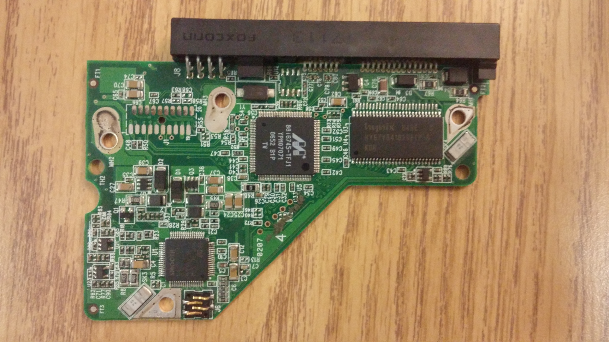

## Hard Drive Reprogramming

For this project, we are taking the controller board from standard hard
disk drives and repurposing them as RAM. Each controller board typically
has 32-64 MB of cache, used when transferring data from the disks to the
computer. We are looking to repurpose that cache memory as RAM
aaccessible directly by the operating system.

**Current Status** Currently we are following a similar project
undertaken on [sprites
mods](http://spritesmods.com/?art=hddhack&page=1). We have identified
the JTAG pins on the controller board, we now need to solder these wires
to the JTAG debugger for manual reprogramming. Updates to come soon.

