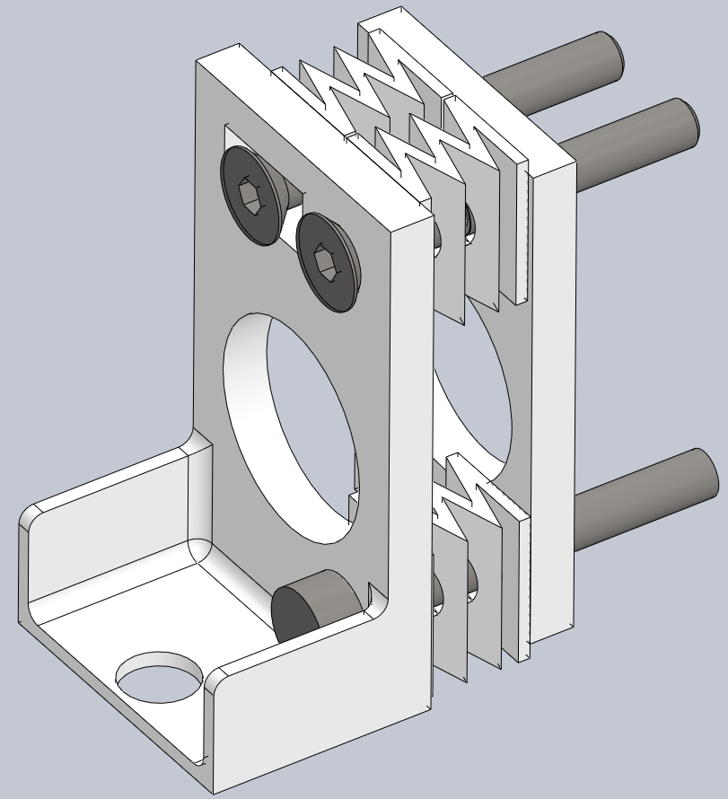
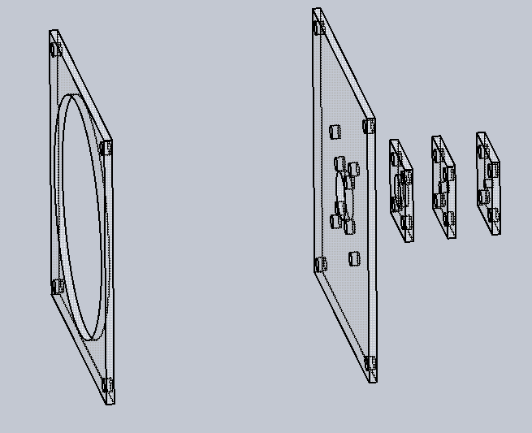

{width="400"}
{width="400"}
{width="400"}

Just as electronic breadboards often rely on integrated circuits
(notably OpAmps), external power, and test equipment, optical tables
also benefit from more than simple packaged lenses. Here we document the
optical tools available at HacDC, many of which are self-made.

Source files are kept at <https://github.com/HacDC/HacDCOptics> .

# Tools

Complex drop-in optical systems, ready to create or analyze complex
light fields.

## WideBeam

A wide beam of high-intensity collimated light is useful for manually
checking the results of complicated optical beampaths. Work in progress
for 2" and 8" optical axis modules.

## DLPMod

HacDC has access to some DLP projectors, absent working light sources.
These can be used as re-configurable image sources and high-speed light
gates.

## Lasers

Variety of 2" optical axis laser mounting hardware in progress.

# Fixtures

Generic mounting hardware.

## Tilt and Roll Platform

Even if we could afford them, commercial systems are too expensive to
permanently dedicate to completed projects (\~\$500). Instead, we will
3D print or laser-cut a screw-adjusted spring-loaded platform, much the
same as the adjustable bed used by many 3D printers.

# Elements

## Spatial Filter

Work in progress for 2" optical axis modules, with varying diameter
pinholes.

# Standards

## External

Standards set for us by manufacturers.

-   Tapped holes, ¼-20" UNC on a 1" (25.4 mm) grid. May be roughly
    compatible with some M6 on 25mm grid for optical systems with
    non-critical dimensions.
-   Standard optical axis heights include
    [330mm/13"](http://www.optikos.com/products/lens-platforms-mounts/),
    and possibly [1.15",
    1.75"](http://www.thorlabs.com/NewGroupPage9_PF.cfm?Guide=10&Category_ID=16&ObjectGroup_ID=60),
    [2", 3.38", 4.5", 6.25", 8"
    <http://www.edmundoptics.co.uk/optomechanics/optical-mounts-plates/lens-mounts/optical-cell-kinematic-mounts/2592>](http://www.edmundoptics.co.uk/optomechanics/optical-mounts-plates/lens-mounts/optical-cell-kinematic-mounts/2592).
-   Cage square lengths include at least [16mm, 30mm,
    60mm](http://www.thorlabs.com/navigation.cfm?guide_id=2002).

## Internal

Standards we have elected to follow from the above, or have established
ourselves, as we build our own tooling.

### mirage335

These standards are chosen to permit quick transition between optical
table, rail, and cage systems, with only small height-adding brackets.

#### Stage

Stages directly connecting to extrusions are named "Series20/40/60"
depending on the minimum width in millimeters. For instance Series40
mounts require two screws, 20mm apart, and have a maximum width of 40mm,
all suitable for mounting on typical 20x40mm extrusions.

Substages mounted to an earlier kinematic stage or bare baseplate must
fit around the rectangular opening for that series.

By default, these standards conform to the "Small" standard under
"Optical Table Axis Heights".

  Series         Axis Height   Opening   MaxThickness   Notes
  -------------- ------------- --------- -------------- ---------------------------------------
  TinySeries20   15mm          14x14mm   6mm            Specialized non-standard axis height.
  Series20       35mm          14x14mm   6mm            Specialized non-standard axis height.
  Series40       30.8mm        18x28mm   6mm            
  Series60       30.8mm        28x38mm   2mm            
                                                        

#### Mounting Holes

Tolerances intended for well-calibrated 3D printers.

##### Table

-   Screw diameter - 6mm (M6) to 6.35mm (¼in UNC) .
-   Hole spacing - 25mm (metric) to 25.4mm (1in imperial) .

```{=html}
<!-- -->
```
-   Hole size - 8mm .
-   Hole spacing - 25.2 mm .

##### Extrusion

-   Screw diameter - 5mm (M5) .
-   Hole spacing - 20mm .

```{=html}
<!-- -->
```
-   Hole size - 5.5mm .
-   Hole spacing - 20.25mm .

#### Optical Table Axis Heights

Standard axis heights are based upon typical hardware for 1" grid
optical tables. Mounts for other arrangements, such as a 20series
extrusions, should use corespondingly lower heights. Options to mount
such hardware to a standard table through intermediate stages, such as
20series extrusions themselves, should be preserved.

Small axis height is typical, and should be assumed unless noted
otherwise.

  Element Size   TableHeight    ExtrusionHeight   Comments
  -------------- -------------- ----------------- ----------------------------------------------------------------------------------------------------------------
  Small          2in/50.8mm     30.8mm            Intended for lenses up to 1" high, including salvaged projector, disposable camera, and microscope components.
  Large          8in/203.2mm    183.2mm           Accommodates larger lenses, particularly for light gathering and projection systems.
  ExtraLarge     13in/330.2mm   310.2mm           Accommodates modest Fresnel lenses.
                                                  

#### Optical Cage Square Lengths

  Element Size   Height
  -------------- --------------
  Small          30mm/1.1811"
  Medium         60mm/2.3622"
  Large          6.25"
                 

# Reference

-   Printed Breadboard - <http://www.thingiverse.com/thing:9040>
-   Aluminum Angle Mounts - <http://www.thingiverse.com/thing:38062>
-   Lens Mount - <http://www.thingiverse.com/thing:26752/#files>
    <http://www.thingiverse.com/thing:62693/#files>
-   OpenSource Optics - <http://www.appropedia.org/Open_source_optics>
-   Linear Translator - <http://www.thingiverse.com/thing:144838>
-   Metal Lens Mounts -
    <http://www.edmundoptics.com/optomechanics/optical-mounts-plates/lens-mounts/>
-   Lasercut Optics Bench -
    <https://hackaday.io/project/10707-lasercut-optics-bench>

[Category:OpticalTable](Category:OpticalTable)
