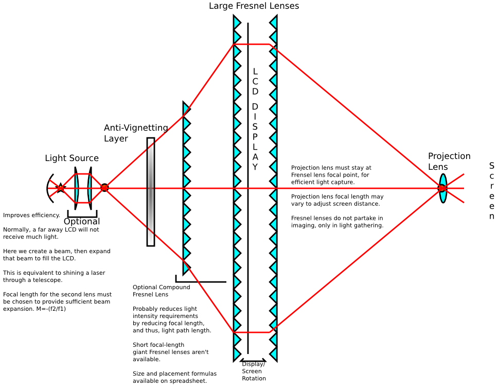

`{{TOCright}}`{=mediawiki}

## Time and Location

:   August 13, 2013
:   Called to order at 1950 by Ben.
:   Members present:
:   Others present: 7
:   [Quorum](Quorum)?

    :   Quorum met?

## Approval of Previous Meeting's Minutes

[Regular Member Meeting 2013 07
09](Regular_Member_Meeting_2013_07_09)

## Recognition

-   Alberto - for running a classy class and giving the kitbuild tools a
    maiden voyage, and for tackling the WP autoupgrade bugs.
-   Dan Barlow - Laser cutter installation and maintenance, working
    dehumidifier, cleanup, optical advice, and generally very hard work.
-   Dan B & Mirage - Safe laser cutter training training.
-   David W - for helping the church guard out by giving him a laptop
    and hopefully for having fixed it by this meeting.
-   Sean N - 1) for successfully forking and merging his genetic code 2)
    for getting a bunch of us on retroshare
-   ITG and Shawn S - for spearheading the next cryptoparty organization
-   haxwithaxe - Prototype frame for DIY HacDC projector.

## Director Reports

### President's Report

Nothing interesting, excited about the laser.

### Vice President's Report

-   working on the de-datacenter machine. got harddrives, need to
    install them.
    -   more efficient hardware, VM support
-   tvb dongle SDR is running at work with gqrx
-   website performance is getting better
-   planning for wired network inside the space

### Treasurer's Report

Here is the financial summary spreadsheet for July 2013:
. We
gained David Pietrocola as a new member (voted in last month), and
prospective members Jeffery Herrity and Robert Ryan-Silva have already
started paying dues. Jason Fox and Chris Danicic were voted in as
members last month but have yet to pay dues; four other members are
delinquent on dues. Graham C., Timothy R., and Nicolas J. (Loki) left.
Six people (members and non-members) made non-dues donations.

#### Project Awesome

Since we only had a surplus of \$109.64, I am adding that entire amount
to our reserves and declining to declare a Project Awesome dividend for
the month of July. Here is the Project Awesome spreadsheet for July:
.
There are currently 15 votes.

Dan mentioned that the Laser project will have money left over. Suggest
that money could be put towards a good projector for the space. If
members want more laser-related bits, please talk with Dan ASAP.

### Secretary's Report

Nothing to report.

### Director-at-Large Reports

#### [Shawn Nock](User:Nocko)

Not present.

#### Rubin

Nothing to report.

## [Project Awesome](:Category:Project_Awesome) Reports

### Project LASER

Dan: an evacuation fan issue arose, still fine for plexiglas, more smoky
materials may be a problem. Working on a solution. Laser will eventually
go into a cabinet with lock and keys. At which point it'll be done.

### Project BYZANTIUM

Ben: next step minor release, done. plan on handing out usb keys. Final
report being worked on, which will complete obligations for grant! More,
post-grant, work is being planned.

### Project KITBUILD

The first HacDC Summer School 2013 session doubled as a Project Kitbuild
session. The new soldering supplies were inaugurated and (mostly) work
great! Special thanks from Alberto go to Katie B, Martin R, haxwithaxe,
and Shawn W for their help that evening. Photos from Katie B linked from
the blog post:
<http://www.hacdc.org/2013/08/summer-school-2013-underway/>

### Project SUPPLIES

Total expenditure: \~\$120

#### Replenishment

-   PLA filament.
-   Copper clad board.
-   Spare PCB milling bit.

#### Expansion

-   PLA polishing solvent for silky smooth parts.
-   Solder paste.

#### Unaccounted

-   Light bulbs for HacDC DIY projector. Not charging to SUPPLIES unless
    other HacDC members agree they should be.
-   IGBT Modules. We may get 3 of these for \$3 each. Usual price is
    \$100 each. Credit to Dan Barlow for the find.

#### Future

-   Building up organized list on the wiki. Please feel free to edit.
    See: <http://wiki.hacdc.org/index.php/Category:PA_SUPPLIES> FIXME

#### Requests for Commentary

-   **Large plastic buckets.** Are these within the PA_SUPPLIES project
    scope? If so, cleanup efforts need them urgently.

### Project SPACECAM

No report?

## Member Reports

### mirage335

#### Biohacking

##### Imagnus

Looking promising. Progress has been made, negotiations are still in
progress, may give further details later.

##### Biosignal Amplifier

More comfortable headgear and 24bit ADC final assembly underway. These
last upgrades promise plug-and-play usability.

#### Laser

Taught about 4 people safe laser cutter usage. Walk-ins welcome
Thursday, and random weekend days.

#### Wiki

Most of our expensive equipment is now listed in at
[:Category:Equipment](:Category:Equipment) FIXME with
pictures. Might be wise to link that to the front page.

#### Projector

HacDC needs a new projector, ideally 1080p and \>5k lumens output.

-   DIY is a well-trodden path. Estimate cost around \$300 and three
    weeks, size at 1000mm\*515mm\*300mm (36"\*21"\*12") with an 80%
    chance of high-performance under budget and time. Any unused optics
    would become core tools in our growing optical lab.
-   Commercial-off-the-shelf costs \$1500.
-   **Either way, funding is needed.**

##### DIY

So far, technical design is by me, labor by haxwithaxe, oversight by Dan
Barlow. {width="500"}

###### Progress

-   Successful projection with stage light, LCD, and overhead projector
    lenses.
-   Complete light path calculation spreadsheet for redesign.
-   Basic optics experiments. Minimum beam expansion with non-laser
    source (light intensity testing) and Fresnel lens stacking.
-   Prototyping frame (excessively large for future-proofing).

###### Equipment Requests

A high-power visible spectrum (ie. Ar/Kr) laser would trivialize this
project.

### Dehumidifier

Bought, working, and draining to the outside. Steam pipe opening sealed.
(cut on 3 sides to enter, tape afterwards)

:   Is it sufficient?

Basement is now dry, and temperature is far cooler (around 78F).

### Alberto - HacDC Summer School 2013

This class series was a great success by several metrics. Alberto
believes that it could form the middle of a 4-month-long HacDC Semester
series consisting of at least:

`* Intro to Electronics, `\
`* Intro to Physical Computing (this series)`\
`* AVR Programming`\
`* Interactive Python`\
`* etc.`

We had the perk of being part of an NPR ATC broadcast about ArduSat's
imminent launch.

Special thanks, again, to Shawn W, haxwithaxe, Katie, and Martin for
helping make it possible for me to do this, and an extra-special thanks
to Julia L for providing emergency projector provisioning for the last
session!!!

### Dan - getting rid of stuff

Metal shelves are being used to get rid of a large batch of stuff.

### Katie - sample laser etchings!

Katie made etchings on the laser cutter. Samples passed around.

### David W

Brought a vacuum pump for a member to borrow. Has \~30 Wyse thin
clients.. if anyone wants 'em. His work \*may\* wish to open a fab lab,
please contact him if interested.

### Burt

Has an Oculus Rift, invites others to get together with him and create
something cool, 1.5 week deadline, \[missed details\].

## Old Business

## New Business

Asking for approval of \$300 for DIY projector.

:   Member approved, 3 dissented.

## New Members

The following were nominated and voted in (woot!!):

-   Tom L. - long time paying member,
-   Brendan -
-   Burt - VR & security
-   Griffin - mesh stuff
-   Evan P. - compared other
-   Rob - likes shiny things
-   Ann - 3DP, laser cutter, has been visiting us for a while
-   Ken - 3DP, misc,

## Adjournment

Adjourned at 2050.

[Category:Meeting Minutes](Category:Meeting_Minutes)
