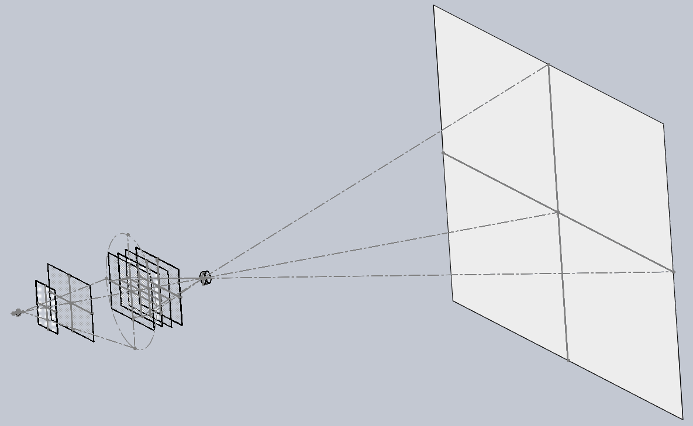
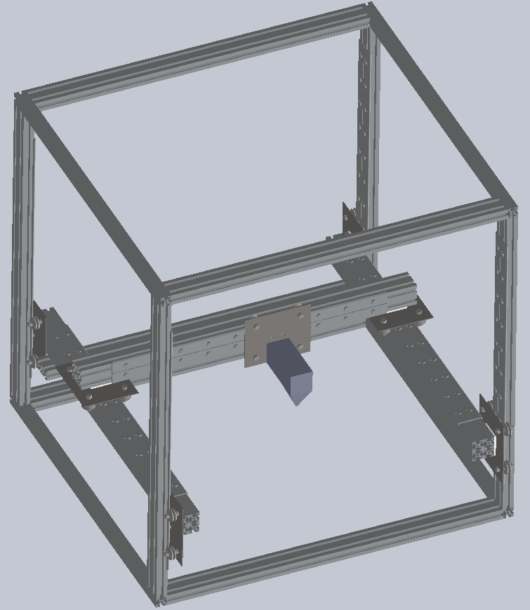
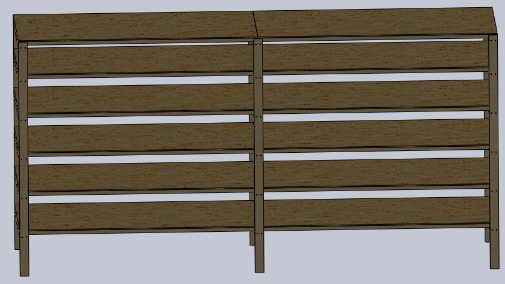
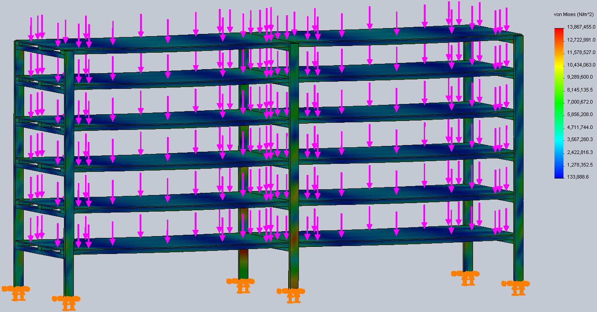

`{{TOCright}}`{=mediawiki}

## Time and Location {#time_and_location}

:   October 8, 2013
:   Called to order at 2008 by Katie.
:   Members present:

Katie, Nadir, Christine, David, Phil, Dan, David, Total of 8 members
present, webcam not up.

:   Others present:

Zac, Brian, Doug, Justin, Blake

:   [Quorum](Quorum)?

    :   Quorum met? No.

Problems in getting Google hangout working on in-house desktop. Got
logged in, but no love. "video call isn't available right now.."

## Approval of Previous Meeting's Minutes {#approval_of_previous_meetings_minutes}

[Regular Member Meeting 2013 09
10](Regular_Member_Meeting_2013_09_10)

[Regular Member Meeting 2013 08
13](Regular_Member_Meeting_2013_08_13)

## Recognition

Silver Spring Makerfaire! They had a great turnout and the organization
was fantastic.

Dan, for continuing to do great laser stuff.

## Director Reports {#director_reports}

### President's Report {#presidents_report}

Absent.

### Vice President's Report {#vice_presidents_report}

Absent, nothing to report from irc.

### Treasurer's Report {#treasurers_report}

Here is the financial summary spreadsheet for September 2013:
. We
gained two new members in September: Alex, who was voted in at
September's meeting, and Brendan, who was voted in in August.

#### Project Awesome {#project_awesome}

Here is the Project Awesome spreadsheet for September:
. I'm
declaring a \$500 Project Awesome dividend, with the remaining \$129.54
of the month's surplus going to our reserves. There are currently 17
Project Awesome votes.

### Secretary's Report {#secretarys_report}

Nada.

### Director-at-Large Reports {#director_at_large_reports}

#### [Shawn Nock](User:Nocko) {#shawn_nock}

Absent.

#### Reuven

Absent.

## [Project Awesome](:Category:Project_Awesome) Reports {#project_awesome_reports}

### Project LASER {#project_laser}

Dan: project going wonderfully. Went to NYC for makerfair, talked to
everyone w/a laser asked about cleaning. They said they had to clean it
all the time. We should stick w/acrylic for now. In the process of
getting new longer focal length lens and other mod to scribe on round
surfaces and larger objects below the unit. Working on new exhaust fan
and a carbon filter for reducing toxicity of exhaust. David W. is
helping (funding?) with cabinet.

### Project BYZANTIUM {#project_byzantium}

No report.

### Project KITBUILD {#project_kitbuild}

No report.

### Project SUPPLIES {#project_supplies}

#### Financial Outlook {#financial_outlook}

Healthy to say the least. At nearly \$1k and rising, budget is
sufficient to cover most major equipment failures at HacDC. After
SUPPLIES budget hits \$1k, further allocation to it should probably be
reduced to a trickle.

#### Future Plans {#future_plans}

-   Spare hot-end for Prusa Mendel.
-   Better glass bed for Prusa Mendel with predrilled holes.
-   Large plastic buckets.
-   Possibly new PCB fab supplies, like CNC milling bits.
-   Possible expansion of parts store, after some clean up at HacDC.

### Project SPACECAM {#project_spacecam}

No report.

## Member Reports {#member_reports}

### Dan

Found a lamp for the projector that the Open projector ppl have been
working with.

Went to NYC Makerfaire. Lots of 3DP variations. Portable mini-router
with x-y movement. Arduino for rocket nose cones, brought one home.
Multi-layer transparencies in a box.. but filled with liquid of near
same index of refraction.. neat effect. Playing with Beagle Bone Black.

### Katie

Lightning Talks coming up. Interested? Get in touch with Katie!
treasurer@hacdc.org 3:30pm

### Christine

Have been looking into badges as a method to accredit people for skills.
Particularly Mozilla's Backpack. Especially good for those of us who may
not learn in more conventional ways. We do a lot of learning here at
Hac, it'd be good to have a more visible way to recognize these things.
She has volunteered to lead an effort and be the Awesome lead for the
project, although there may not be a need for financial support. Emails
to go out and solicit ppl for badge ideas and help.

Nov 16 at 1600 Crypto party!

### mirage335

Despite having been away from HacDC for a bit, I've been rather busy on
things relevant to it. Pardon the long winded report...

#### Occupancy Sensor {#occupancy_sensor}

Easily returned to fully operational status, an even more reliable
solution is imminent.

#### Biohacking

##### Imagnus

Going well. Obtained permission to discuss some of the details of these
arrangements. Although nothing has been signed yet, it seems reasonable
to keep their concerns in mind.

###### NDA

We have negotiated fair, acceptable, and open-source friendly terms.

-   Wide latitude to use, distribute, relicense, etc, our own
    technologies with a few very specific provisions. Basically, we
    agree not to commercialize a directly competing product as defined
    by a narrow FDA category, and not to publicly mention Imagnus's
    connection to the technologies.

Basically, we retain rights to key technologies for our projects.

-   Non-transferable. Automatic expiration on conditions that may amount
    to corporate takeover. Put another way:

> There are literally several levels of SCO being wrong. And even if we
> were to live in that alternate universe where SCO would be right,
> they'd still be wrong. -Torvalds

This shall not happen to us.

-   NDA expires in two years.

Important lessons have been learned negotiating the NDA that probably
should be applied to similar arrangements in the future.

###### Expected Benefits {#expected_benefits}

A few hundred dollars, probably soon. Royalty payments, probably much
more significant.

###### Status

The project is complex, and we are making excellent progress.

##### Biosignal Amplifier {#biosignal_amplifier}

Revised design for 24-bit USB ADC board. This will soon be merged with
the host board, tidying up the biosignal amplifier, and giving it a USB
port.

Additionally, the standalone ADC will likely make it to the test cart,
providing extremely high resolution signal capture and processing
capabilities.

See [github](https://github.com/mirage335/ArduinoDAQ) for the standalone
USB ADC.

{width="200"}

##### Projector/OpenDisplay

<http://washingtondc.craigslist.org/search/zip?query=projection&zoomToPosting=&srchType=A&minAsk=&maxAsk=>

We still need three giant Fresnel lenses from rear projection TVs. A
HacDC member recently obtained two of these from Craigslist. We need
three more. Project is stalled until we get these lenses.

###### Design/OpenSource

Just a reminder, the design is published, with CAD models, as
OpenDisplay.

<https://github.com/mirage335/OpenDisplay>

{width="500"}

##### FlexReplicator

Advanced multi-tool desktop factory based on OpenRail.

Intended to simultaneously operate multiple milling, laser, extrusion
(FDM 3D Printing), and inkjet (powder 3D printing, 2D coloring) tools.
Simulations indicate deflection should be 8mm/metricTon of lateral
force.

Nearly complete design, just needs actuators (ie. threaded rod, timing
belts).

{width="400"}

##### Project EXPANSION {#project_expansion}

We might want to fund new purchases (eg. metal working tools) or
projects (eg. better laser cutter) to expand HacDC capabilites. Plan to
propose a project awesome EXPANSION fund for this purpose.

Would like to see this operate democratically, with proposed
purchases/projects and votes on the project's wiki page.

##### myDAQ and myDSP {#mydaq_and_mydsp}

AFAIK, Ahmed Aden obtained a [myDAQ](http://www.ni.com/mydaq/) and
[myDSP](http://sine.ni.com/nips/cds/view/p/lang/en/nid/211871) for us
almost a year ago. These devices can add core testing and signal
processing capability to our test cart.

Eric Miller has been holding them since. Reportedly, he has not been
using them, but is unwilling to make a "special trip" to deliver them
back to us. It is also possible that he has lost track of, or otherwise
did not verify, the software requirements.

Unless they were in fact purchased with Eric Miller's own money for his
own use (and he has repeatedly not answered this question), it seems
time for them to return to HacDC.

##### PCB Fab Efforts {#pcb_fab_efforts}

Have been trying to fabricate professional quality circuit boards, with
6mils or less isolation widths, and no excess copper. So far, almost
acceptable results have been achieved using the laser cutter with
fingernail polish resist and chemical etchant. More still to be done.

##### ToDo Tracker {#todo_tracker}

An experimental project/task management application using web2project
has been created for HacDC members and guests. Please see [HacDC
Projects](http://mirage335.dyndns.org/hacdcprojects/), and add anything
that might benefit HacDC.

##### HacDC Shelves {#hacdc_shelves}

Recommend we allocate \$600 for two of these shelving units, one in each
room. Also recommend someone besides myself build them (eg. haxwithaxe),
which shouldn't take more than a day.

Designed for HacDC Basement. Intended for placement a few feet away from
wall in both rooms, accessible from both sides, providing a sort of
warehouse. 8' high, 16' long, 4' deep, 16" elevations, density-optimized
reinforcement. \$264.99 for 384 sq.ft. at \$1.44/sq.ft.

For comparison, I estimated the shelves on the back wall of the workroom
to offer only about 50 sq. ft.

There will still be plenty of room in the basement for the optical table
and power tools. In fact, this will definitely increase the available
space both upstairs and in the basement as items are taken off the
floor.

Please see [github](https://github.com/HacDC/BasementShelves) for CAD
model, BOM, and simulation results.

{width="800"}
{width="800"}

### Alberto

(Sorry to have to miss the meeting. Work!)

I will be sponsoring one of Washington Project for the Arts'
Professional Practices workshops. On Nov 3, two speakers will talk about
3D printing software workflow and some how-tos to about 18 participants.

Smithsonian Institution's [x3D conference](http://3d.si.edu) in November
will have a HacDC presence. I've asked Andy T. to setup a demo of his
hi-res 3DP DIY project. If anyone has any open source 3D printing
projects that are pushing the envelope, it would be great to have
another project represented. I plan on flying the HacDC flag on the
table. We'll set up in the exhibits area. If there are more materials to
distribute, get in touch with me. More later. Oh, the emphasis will be
on 3D printing for museums so if anyone is interested, register at the
site. It's FREE but seats are limited.

## Old Business {#old_business}

Nada.

## New Business {#new_business}

Nada.

## New Members {#new_members}

-   Blake - been coming for months, esp. on Mondays for
    MicroControllers, loves it.
-   Justin - wants to make an automated baking bot (may need cookie
    testers!).
-   Zak - on-board vehicle monitoring.

All 3 were nominated and voted in!

## Adjournment

Adjourned at 2056.

[Category:Meeting Minutes](Category:Meeting_Minutes)
