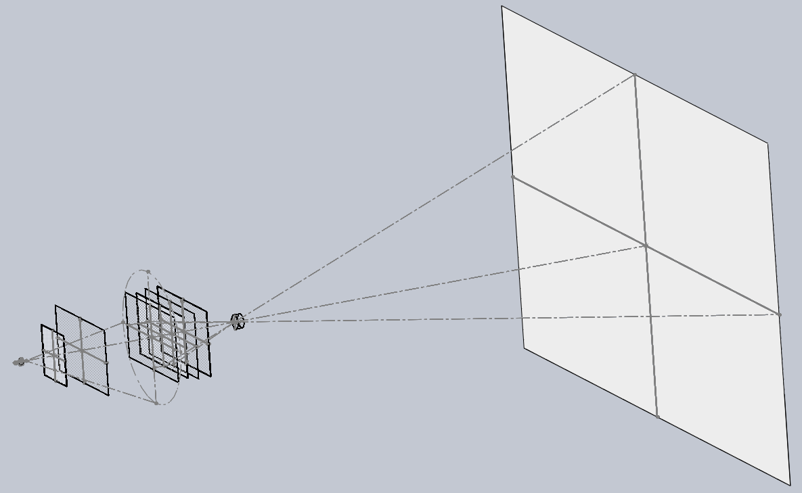
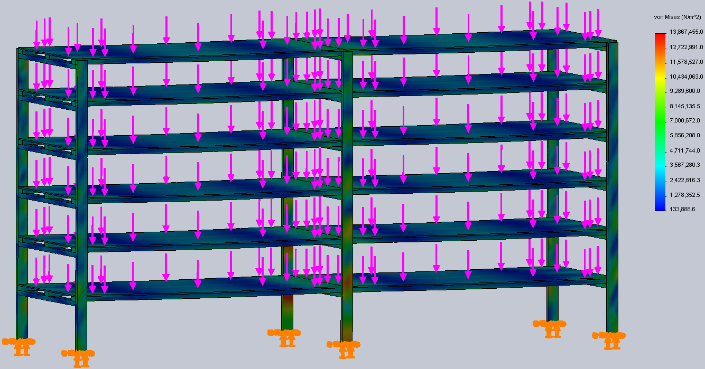

`{{TOCright}}`{=mediawiki}

## Time and Location {#time_and_location}

:   November 12, 2013
:   Called to order at 2005 by Ben
:   Members present: Dan, Hax, Katie, Reuven, Nadir, David W, Evan,
    David M

Online: Kevin, Christine, Phil, Jamie, Lee

:   Others present:

```{=html}
<!-- -->
```

:   [Quorum](Quorum)?

    :   Quorum met?

Nope.

## Approval of Previous Meeting's Minutes {#approval_of_previous_meetings_minutes}

[Regular Member Meeting 2013 10
08](Regular_Member_Meeting_2013_10_08)

[Regular Member Meeting 2013 09
10](Regular_Member_Meeting_2013_09_10)

[Regular Member Meeting 2013 08
13](Regular_Member_Meeting_2013_08_13)

## Recognition

-   **Dan Barlow** - Continued laser cutter upgrades and maintenance.
-   **juri aka. Julia Longtin** - Two \~40mm aluminum extrusions, two
    more on the way. These are extraordinarily rigid, and expensive. We
    should build a large-area high-precision CNC machine on the optical
    table with these ASAP.
-   **Katie** - Continued treasury support, and organizing the Lightning
    Talks.
-   **nootroope aka. Alberto** - Hosting a class at HacDC for CAD
    modeling and 3D printing, two highly important skills. Awesome!

## Director Reports {#director_reports}

### President's Report {#presidents_report}

-   Byzantium grant is over, mostly. Submitted final report. Response
    yesterday: website down, re-org going on, they say it'll be back.
-   Trying to get some corporate sponsorship from work.
-   Brad is leaving this weekend, party at the Derby on Friday

### Vice President's Report {#vice_presidents_report}

From Doc, desktop going to crash cart. From juri, 1U nice server being
put to use.

### Treasurer's Report {#treasurers_report}

Here is the financial summary spreadsheet for October 2013:
. We
gained Blake, Justin, and Zach, who were all voted in last month. We
lost The Doc to San Francisco, Jason Fox to Argentina, and R. Mark
Adams, PhD, to Cambridge.

#### Project Awesome {#project_awesome}

Here is the Project Awesome spreadsheet for October:
. I'm
able to declare a \$1000 dividend and add \$284.54 to our un-earmarked
reserves. There were 17 votes, unchanged from the previous month.

### Secretary's Report {#secretarys_report}

A big thank you to Alberto for answering lots of incoming queries from
info@hacdc.org! ..and teaching and repping us!

### Director-at-Large Reports {#director_at_large_reports}

#### [Shawn Nock](User:Nocko) {#shawn_nock}

#### Reuven

## [Project Awesome](:Category:Project_Awesome) Reports {#project_awesome_reports}

### Project LASER {#project_laser}

Dan: Larger objects can now be placed under the laser. Added 5" lens,
looking at adding another focal length, already has money.
`<b>`{=html}Wants feedback for longer term project..`</b>`{=html} How
about a 100w source in addition to the current source? Do people want to
cut through materials that the current source isn't adequate for?

### Project BYZANTIUM {#project_byzantium}

Porting Byz over to Wifi Pineapple mk5. It has 2 transceivers and its
hardware is largely linux friendly with fairly beefy hardware for a
router.

Found some bugs, addressing them.

Some ideas that got pushed back during the grant are starting to receive
attention. Expect a new build not too far into the new year.

### Project KITBUILD {#project_kitbuild}

I've been busy with other activities at HacDC, but would like to help
organize a kit build early next year. Presently going over options and
seeing whether I can plan to build upon the kitbuild's kit with a
follow-on workshop that uses it to teach some aspect of electronics or
programming. One option is a kit that might use an AVR. The Late Elliot
Williams^®^ has an [AVR programming book from
O'Reilly](http://shop.oreilly.com/product/0636920028161.do) due out in
December. I expect a copy soon and will go over it with these goals in
mind!

### Project SUPPLIES {#project_supplies}

#### Financial Outlook {#financial_outlook}

At \>\$1.4k, we have a sufficient reserve to make major repairs
(\~\$300) to 3D printer, CNC mill, and laser cutter simultaneously.

Recommend members who voted for SUPPLIES to change at least 80% of that
vote to EXPANSION.

#### Recent Purchases {#recent_purchases}

-   Spare Prusa Mendel hot-end (\$87.00).
-   Laser cutter upgrade materials (\$18.19).
-   Small plastic containers. Useful as storage for small parts, solder
    paste tools, or laser cutter stock (\$13.72).

#### Prusa Mendel {#prusa_mendel}

Ordered waterjet laser cut custom glass bed. Unfortunately, it cracked
on installation, so I have **eaten the \>\$68 cost** :'(. Continuing
attempts to laser cut, or manually cut, a new sheet of glass.
Alternatively, an overlay may be used, see the red plastic mounted over
glass on the printer.

For anyone interested, [One Day Glass](http://www.onedayglass.com/) does
offer excellent service.

#### Future Plans {#future_plans}

More white PLA plastic will be ordered soon.

After cleanup at HacDC, can consider improving generic supplies like
mill stock, electronic components, laser cutter stock, and hardware (ie.
screws).

### Project EXPANSION {#project_expansion}

Newly proposed, general description on the
[PA_EXPANSION](http://wiki.hacdc.org/index.php/Category:PA_EXPANSION)
wiki page.

#### Simplified Mission Statement {#simplified_mission_statement}

We might want to fund new purchases (eg. metal working tools) or
projects (eg. better laser cutter) to expand HacDC capabilites.
Personally, I would like us to obtain a minimum footprint and expense
toolset to develop almost anything in the manufacturing, electronics,
optics, particle physics, semiconductor fabrication, biohacking, and
software categories.

Would like to see this operate democratically, with proposed
purchases/projects and votes on the [Project
Tracker](http://mirage335.dyndns.org/hacdcprojects/index.php?m=projects&a=view&project_id=6).
Alternatively, feedback on the wiki page, or any feedback would be
appreciate.

-   Meeting:

Light discussion on how EXPANSION is different than SUPPLIES. No
lingering questions.

#### Buy/Build Policy {#buybuild_policy}

Some preference will be given to equipment which is already available as
commercial-off-the-shelf (COTS), already constructed, or constructed
from available materials (eg. Mouser parts, 3D printed brackets, etc).
Longer term projects may be funded less readily.

#### Important Dislcaimer {#important_dislcaimer}

-   **This is a fairly general purpose fund. Members voting for it are
    strongly encouraged to participate by watching the Project
    Tracker.**
-   Members may propose their own projects, however, anything funded
    under these HacDC funds must benefit HacDC's mission, and is is
    HacDC property unless officially voted otherwise at a member
    meeting.
-   There are a few projects of my own I would like to eventually fund
    and build through this project for HacDC, such as an advanced linear
    power supply (\~\$50) and electron beam microscope (design in
    progress).
-   Some tools on this list are necessarily expensive, I do not intend
    to absorb all failed expenditures.

### Project SPACECAM {#project_spacecam}

Wants to suspend until network infrastructure issues are addressed.

### Project BADGES {#project_badges}

Doing background research and at the point now where ready to present to
others. [Here's a
summary](http://facilitatingchange.org/2013/11/badges-for-development/)
(written for international development projects, but still applicable).

Sec's note: group says this isn't an official PA yet. Notice needs to be
sent to member's list describing it. Christine says she understands.

## Member Reports {#member_reports}

### Martin

-   HARC Technician License prep class 11/13 and FCC License exam
    session 11/23.
-   David and I are wrapping up installation of a donated asterisk
    server and VOIP phones at St. Stephen's.

### Alberto

-   On 13 and 14 November, Andy Ta and I will be staffing a table at
    Smithsonian's inaugural [SI X 3D](http://3d.si.edu) conference on
    behalf of HacDC. They have us sitting between Autodesk's and 3D
    Systems' tables. \<\_\< We'll be featuring Andy Ta's OpenDLP
    stereolithographic printer. Thanks to Andy for letting us ride his
    coat tails to glory!
-   The WPA 3D workshop went really well and they donated \$60 to HacDC.
    \<3

### mirage335

Pardon the long winded report...

**Project EXPANSION (above), the low temperatures, and the Basement
Shelves are the important items.**

#### Temperature

It's getting colder. Low temperatures are generally less problematic
than high temperatures, but some of our equipment (ie. **laser tube**)
will **self-destruct** as **0C** is approached. If safe, perhaps we
should invest in a window unit with heating capability in the back room.

Leaving the laser tube pump running indefinitely has also been
suggested.

-   Hax: talked with Brian, small heating pad seems to be the solution.

#### Occupancy Sensor {#occupancy_sensor}

False indications (bounce) occurred Sunday night, however, normal
functionality returned in the morning. Probably due to low temperatures
slowing down the MCU oscillator. A more reliable system has been
published at
[github](https://github.com/mirage335/EasyPLC/blob/master/GenericMainboard.pcb.png).
Nevertheless, the low temperatures observed are cause for concern.

#### Biohacking

##### Imagnus

###### NDA

As reported last month, participating members will retain rights to
their own technology. Important lessons have been learned negotiating
the NDA that probably should be applied to similar arrangements in the
future.

###### Expected Benefits {#expected_benefits}

A few hundred dollars, probably soon. Royalty payments, probably much
more significant.

###### Status

More progress. Will give more information with permission. Has eaten far
more of my time than expected lately.

##### Biosignal Amplifier {#biosignal_amplifier}

USB 24bit ADC merged with host board and built. Medically isolated RECOM
power supplies integrated. Batteries and soundcards eliminated, proper
casing and software support in progress.

{width="200"}

##### Projector/OpenDisplay

<http://washingtondc.craigslist.org/search/zip?query=projection&zoomToPosting=&srchType=A&minAsk=&maxAsk=>

Two giant Fresnel lenses have been delivered to HacDC's basement.
`<b>`{=html}We still need three more giant Fresnel lenses from rear
projection TVs.`</b>`{=html} Project is stalled until we get these
lenses.

Alternatively, it may be possible to optically combine smaller displays,
an approach which could offer even greater light output and resolution.
However, this would require a video combiner, and alignment would be
technically challenging.

-   David W: can gain access for someone to the recycling center and
    pick parts.. Dan chimed in as willing to help.

###### Design/OpenSource

Just a reminder, the design is published, with CAD models, as
OpenDisplay.

<https://github.com/mirage335/OpenDisplay>

{width="500"}

##### FlexReplicator

Advanced multi-tool desktop factory based on OpenRail.

Intended to simultaneously operate multiple milling, laser, extrusion
(FDM 3D Printing), and inkjet (powder 3D printing, 2D coloring) tools.
Simulations indicate deflection should be 8mm/metricTon of lateral
force.

Still in progress. Nearly complete design, just needs actuators (ie.
threaded rod, timing belts).

{width="400"}

##### myDAQ and myDSP {#mydaq_and_mydsp}

Ahmed Aden bought us a [myDAQ](http://www.ni.com/mydaq/) and
[myDSP](http://sine.ni.com/nips/cds/view/p/lang/en/nid/211871) for us
almost a year ago. These devices can add core testing and signal
processing capability to our test cart.

Eric Miller has been holding them since. Reportedly, he has not been
using them, but is unwilling to make a "special trip" to deliver them
back to us. It is also possible that he has lost track of, or otherwise
did not verify, the software requirements.

They were NOT purchased with Eric Miller's own money for his own use.
Ahmed Aden has volunteered to ask him to return these tools, and we
agree the request needs to be polite.

That said, I am deeply disappointed in Eric Miller's conduct.

##### PCB Fab Efforts {#pcb_fab_efforts}

A variety of approaches have been tried to fabricate professional
quality circuit boards on the laser cutter. All have failed, and the CNC
mill remains superior. Our CO2 laser is just not suitable for this kind
of work.

##### ToDo Tracker {#todo_tracker}

Please see [HacDC Projects](http://mirage335.dyndns.org/hacdcprojects/),
and add anything that might benefit HacDC.

##### HacDC Shelves {#hacdc_shelves}

**Recommend we allocate \$600 for two of these shelving units, one in
each room**. Also recommend someone besides myself build them (eg.
haxwithaxe), which shouldn't take more than a day.

Designed for HacDC Basement. Intended for placement a few feet away from
wall in both rooms as necessary, accessible from both sides, providing a
sort of warehouse. 8' high, 16' long, 4' deep, 16" elevations,
density-optimized reinforcement. \$264.99 for 384 sq.ft. at
\$1.44/sq.ft.

For comparison, I estimated the shelves on the back wall of the workroom
to offer only about 50 sq. ft.

There will still be plenty of room in the basement for the optical table
and power tools, particularly if we do not immediately implement the
second unit. In fact, this will definitely increase the available space
both upstairs and in the basement as items are taken off the floor.

Please see [github](https://github.com/HacDC/BasementShelves) for CAD
model, BOM, and simulation results.

{width="800"}
{width="800"}

##### Corporate Membership {#corporate_membership}

At least two organizations are interested in corporate membership.
Perhaps we should put together a policy on this, focused on keeping
financial gains high enough to justify any risks. A supplementary remote
or RFID entry system might also be helpful.

### David W {#david_w}

F3 robot arm went to UMD at Robotics center, being used by student for
project.

## Old Business {#old_business}

n/a

## New Business {#new_business}

### Shelves

\$600 for shelves to mirage.

-   Quorum not met, could not vote.

### Honorary Memberships {#honorary_memberships}

#### The Doctor {#the_doctor}

The Doctor is one of the founding members of Project Byzantium and one
of the largest contributors to the project. He has made numerous other
contributions including donating time and equipment to improve the
space, and helping us to network with other individuals and
organizations with shared interests.

#### Bradford Barr {#bradford_barr}

Former President of HacDC. He is also headed off the SF. Brad has been a
long-time supporter of HacDC's mission. He donated a lot of time to
HacDC over the years including teaching a number of classes on a variety
of topics from Python to lockpicking to yo-yos.

#### R. Mark Adams, PhD {#r._mark_adams_phd}

Long time member and contributor to the space.

## New Members {#new_members}

None.

## Adjournment

Adjourned at 2108.

[Category:Meeting Minutes](Category:Meeting_Minutes)
