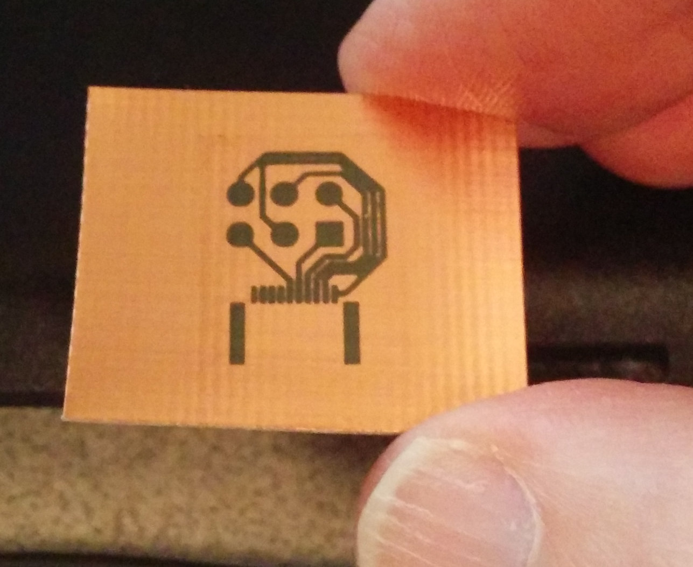
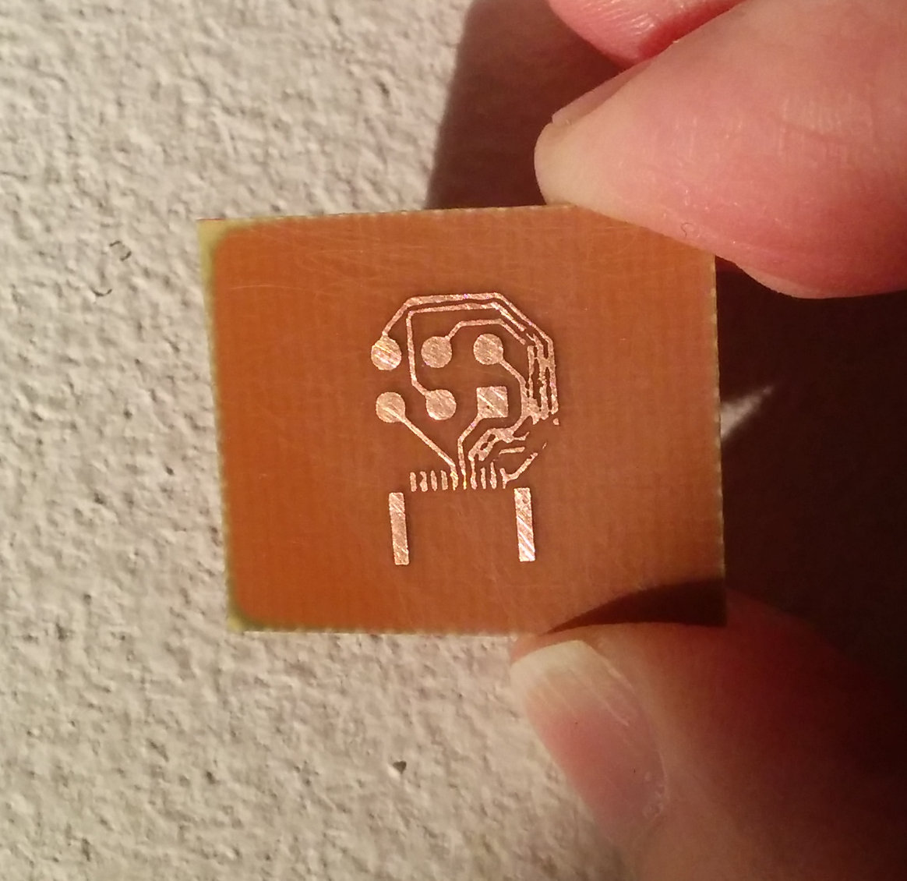
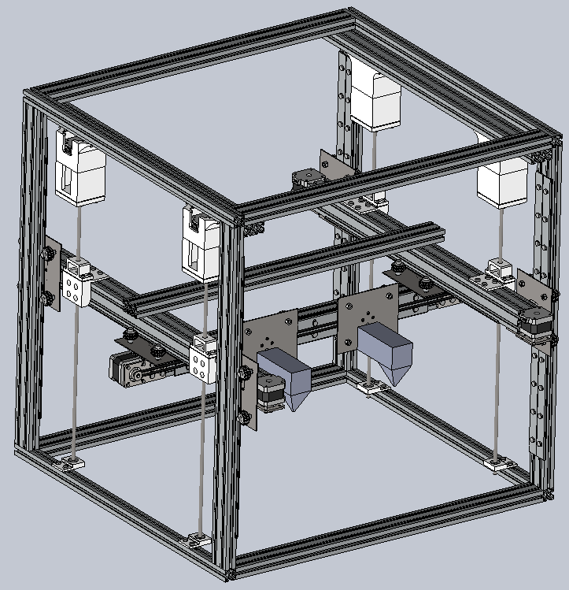

`{{TOCright}}`{=mediawiki}

## Time and Location

:   January 14, 2014
:   Called to order at 1947 by Katie
:   Members present:

Katie, Jamie, Zach, Martin, Phil, Julia, Kevin, David, Dan, Mirage,
Kevin, David, Sharad, Hax, Alberto, Erica (at the very end).

:   Others present:

Butch, and missed 3

:   [Quorum](Quorum)? 15

    :   Quorum met? YES!! Finally

## Approval of Previous Meeting's Minutes

[Regular Member Meeting 2013 11
12](Regular_Member_Meeting_2013_11_12)

[Regular Member Meeting 2013 10
08](Regular_Member_Meeting_2013_10_08)

[Regular Member Meeting 2013 09
10](Regular_Member_Meeting_2013_09_10)

[Regular Member Meeting 2013 08
13](Regular_Member_Meeting_2013_08_13)

-   All above meeting minutes approved.

## Recognition

-   Ahmed Aden. Retrieving our myDAQ and myDSP from Eric, as well as
    introducing me to an instructor trying to learn and share electronic
    design expertise.
-   "condew". Sorting through the LCD panels in the workshop.
-   Dan Barlow. Lots of help on lots of things, really awesome person,
    always a joy to see.
-   haxwithaxe. Confirming MiniVNA purchase.
-   Julia Longtin (aka. juri). Added even more to the \$1k worth of our
    thick aluminum extrusions. Continues to sponsor our projection
    capacity!

:\* Extrusions may be used for a gantry on the optical table.. for CNC
and 3DP!

-   Katie Bechtold. Continuing to serve as our treasurer, promptly doing
    an excellent job.
-   Kevin (@artetechnica.com) for setting up a remote teleconferencing
    system.
-   Sharad Satsangi. Getting involved in more biohacking work again.
-   Zack. Brought all the right expertise, tools, materials and
    enthusiasm to build the basement shelves.
-   Various members on the mailing list for constructive criticism
    regarding the new shelves.

## Director Reports

### President's Report

-Not present.

### Vice President's Report

-   influenza ftl
-   minivna extension purchased
-   grand canyon observed
-   heard a journalist on the kojo show (wamu) casually refer to hackers
    in a good way.

### Treasurer's Report

Here is the financial summary spreadsheet for December 2013:
. One
prospective member (not yet voted in) has started paying dues. Longtime
member and generous contributor Tim Collins has resigned his membership.
Several members haven't paid their dues for a couple of months, and
since they've been unresponsive over e-mail it's unclear whether they
intend to resign.

#### Project Awesome

Here is the Project Awesome spreadsheet for December:
. I'm
able to declare a \$200 dividend and add \$132.29 to our un-earmarked
reserves. There were 16 votes, unchanged from the previous month.

### Secretary's Report

Reduced wiki users from \~140k to 1.1k (bots, bots, and damned bots).
Verified that all wiki software is updated.

-   Want to focus on HacDC's calendar.. meaning, if you know of
    something interesting happening, send it to
    [mailto:secretary@hacdc.org](mailto:secretary@hacdc.org)

.. though I'll probably pick up anything on Blabber

### Director-at-Large Reports

#### [Shawn Nock](User:Nocko)

Moved down South. Relinquishing membership and therefore directorship.

#### Reuven

-no report

## [Project Awesome](:Category:Project_Awesome) Reports

### Project LASER

Dan: Made a snowflake with the laser cutter for security guard. ..well
appreciated. Various acrylic sheets available for use for the laser
cutter. Suggested donations marked, but not required. If you don't care
about color, use clear, it's cheapest. Red is the most expensive.

### Project BYZANTIUM

-   We are currently scattered all across North America.
-   We have joined a group working on disaster relief networking with a
    focus on delay tolerant tools for identifying casualties and missing
    people. The group consists of people from commotion wireless and a
    few other projects, and has been organized by Geeks Without Bounds.

### Project KITBUILD

No planned kit builds but gearing up to have one in the Spring. Work is
too damn high, until then. - Alberto

### Project SUPPLIES

Healthy and stable at \~\$1.4k.

#### Recent Purchases

-   Glass sheets for Prusa Mendel.

### Project EXPANSION

Only \$145 after two months. At this rate, it will take another three
months to buy a vertical bandsaw.

If you are holding one of the 3.783 votes for SUPPLIES, **please
consider voting for EXPANSION instead**.

### Project SPACECAM

Modest improvements made. Using personal 4G which helps with the hangout
connection. Discussion of placement of cameras in the classroom. How
many? Cover multiple angles or just one? Asked about mounting
microphone, drilling into walls. Response was not to drill into
structural things, just mount via strap. Wants long usb cables, say 25
feet or more. Wants to mount the projector David W. donated to ceiling..
no objection. May want to buy Pineapple things that Byzantium uses.

## Member Reports

### Alberto

I'm proposing to expand the HacDC Summer School series and have
preliminary interest in an Intro to Electronics and I'll be repeating
the physical computing series with DangerShield (a kit build!) +
Arduino + Processing. If anyone wants to run a Python for physical
computing or Pygame workshop (or a few), please contact me. I hope to
get someone who will run a AVR Programming workshop as well.

### mirage335

#### Prusa Mendel 3D Printer

Finally, the machine is stable, reliable, and producing high quality
results, down to **75 microns**. Improvements include:

-   Solid aluminum groovemount bracket, CNC milled at HacDC, unlikely to
    degrade.
-   Print bed stackup documented at
    <http://wiki.hacdc.org/index.php?title=PrusaMendel_Print_Surface> .
-   Vastly improved Slic3r settings.
-   Spare parts. If it isn't over-engineered, we probably have multiple
    spares.

No further downtime is expected.

#### Photolithography PCB Fab

Have literally attempted every reasonable PCB fab technique, including
etching spraypaint with our CO2 laser cutter, laser-printer toner
transfer, scribing spraypaint with the CNC mill, and finally
photolithography. At this point, the chemical process has been fully
tested with excellent results, we just need a better printer for
higher-quality photomasks.

{width="200"}

Exposed and developed photoresist. Note the rather solid bare/resist
regions. Fused lines are due to printed photomask quality.

{width="200"}

Chemically etched copper. Note the high-quality edges on the large pads.
Uneven and lost traces are due to manual cleanup attempt.

#### HacDC UV Laser Cutter

The CO2 laser cutter does not add any particularly novel functionality
to HacDC. Lacking precision, it is only useful where a shopbot would
likely be more versatile.

To bring higher-resolution laser cutting to HacDC, a UV 405nm laser has
been strapped to our CNC mill. Unfortunately, this laser is estimated at
\<100mW, limited to cutting thin, dark paper. Using a 2W laser like
[this one for
\$70](http://www.ebay.com/itm/2W-445nm-M140-Blue-Laser-Diode-in-Copper-Module-W-Leads-Three-Element-Glass-/170892986250?pt=LH_DefaultDomain_0&hash=item27ca04078a)
would allow us to laser spraypaint off circuit boards for etching, cut
high-quality soldermasks, scribe fine-pitch text, etc.

Of course, a 2W UV laser raises some safety concerns, so only trained
individuals should use that with the appropriate safety equipment (just
like any other laser cutter).

#### MiniVNA Extender

Thanks to haxwithaxe confirming the order, we now have an 1.5GHz
extender for our vector network analyzer en route. This enables UHF
antenna testing, transmission line testing, mid-range capacitor/inductor
parasitic testing, and more.

#### Projector/OpenDisplay

Have 3 giant fresnel lenses from old projection TVs. If we can use the
badly scratched Fresnel upstairs out-of-focus in the light gathering
optics, **we only need one more of these lenses** from old projection
TVs on
[craigslist](http://washingtondc.craigslist.org/search/zip?query=projection&zoomToPosting=&srchType=A&minAsk=&maxAsk=).

Also, a modular pallet-and-rail will be used for the optics this time.
The prototype frame that has been taking up space in the workshop is no
longer useful, and was disassembled for that reason.

#### Flex Replicator

Multi-tool desktop factory platform. CNC Mill, Laser Cutter, 3D printer,
and more, all simultaneously.

Design mechanically complete. MDF print surface will be added, along
with brackets and laser-safety walls. Should be able to build one of my
own within the month.

{width="200"}

Open-source, hosted on
[github](https://github.com/mirage335/FlexReplicator) .

#### Optical Table CNC

We have been recently donated about \$1k worth of large aluminum
extrusions. We now have the resources to build full gantry on the
Optical Table at minimal expense. Soon as that Optical Table is on its
feet, will outfit it with a variety of milling/extruding/lasering tools.
Similar to the Flex Replicator, but **much larger at 8' x 4' , and
likely accurate to 0.5 microns**.

We should then be able to make large wood frames, print hundreds of
objects in a week, etc.

**This is urgently stalled by the HacDC cleanup. Lack of a large area
CNC has recently cost at least 150 hours of my time at HacDC while
maintaining 3D printer and laser cutter, and more projects are
waiting.**

#### Biohacking

##### Imagnus

We have a really cool product. While we would prefer not to tip off any
competition as all of the exact mechanisms behind it, the system does
work, and we are prepared for even more in the next few weeks.

Stay tuned!

##### Biosignal Amplifier

BiosignalProcessor host/driver software under development, hosted on
[github](https://github.com/mirage335/BiosignalProcessor) . Help
welcome.

[SigBlockly](http://mirage335.dyndns.org/wiki/Category:SigBlockly#Progress)
has been released. This graphical programming environment eases C
development for signal processing and control systems tasks.

[C_CMake_Template](https://github.com/mirage335/C_CMake_Template) has
been released, to ease development for new C software projects.

Host driver software is therefore nearly finished. Once libsndfile has
been integrated properly, users will have an ultra-high-performance
two-channel 'plug-and-play' USB ECG/EMG/EEG.

##### Thursday Meetings

The Thursday biohacking meetings have been getting quiet, but the core
members still occasionally drop by and express interest. With the
biosignal amplifier nearly finished, and hopefully more tools deployed
at HacDC, we should be able to resume other projects.

#### Basement Shelves & Cleanup

Members are encouraged to discuss floor plan options with mirage335
after the meeting.

Personally, mirage335 has invested a lot into expanding HacDC
capabilities, and doesn't see the following as particularly beneficial
to those efforts:

1.  Cutting down the new shelves without first providing an adequate
    alternative.
2.  Unduly bureaucratizing new materials or equipment at HacDC.

Feel free to skim over the rest of this section during the meeting.

\[Lively discussion..\] There's disagreement on how to use the space and
the amount of items being stored here and the clean up efforts.
Discussion wasn't making progress and will continue after the member
meeting.

##### The Debate

Despite a full CAD model, lengthy comment period, and general consensus
that the shelves should be built, all well in advance of their
construction, suggestions have emerged to cut down the new shelves,
among other things.

Please consider:

1.  If the shelves were not built, we would still be doing nothing
    effective about lack of storage, cleanup, or equipment workstations,
    probably for several more years.
2.  Cutting down the new shelves could delay cleanup and equipment
    workstations more months and years. Every project risks
    non-completion.
3.  Alternative uses for the basement are going nowhere at that rate
    anyway.
4.  Smaller shelves will not give us any unused storage space, leaving
    no room for growth.

Also, it is worth noting:

1.  AFAIK, HacDC is paying very little rent for that basement, among
    other things I might say on that point.
2.  About \$300 and four person-days of effort have gone into the
    shelves. Jeopardizing that needs something to show for doing so.
3.  Those who want something dramatically different can build it,
    demonstrate that it works, and THEN propose removal of older
    solutions.
4.  Personally, I have put in at least several hundred hours cleaning up
    the space as well as maintaining HacDC's 3D printer and laser
    cutter. At least half that time was wasted due to lack of
    maneuvering room, a problem these shelves are needed to solve.

On the positive side, there are some more reasonable ways to address
concerns raised in the debate, outlined below. Also, next time I propose
something like this (if ever...), dimensions will be included in the
render image.

##### Wheels

At a cost of approximately \$43.17, we can add wheels to the shelves
capable of supporting 1.6 metric tons. Additional wheels or fixed
supports can be fitted later.

<https://raw.github.com/mirage335/OpenBuildings/master/Units/Shelves/Render.png>

Since some concerns have been raised about placing more than a metric
ton on wheels, this should probably be done only if members absolutely
insist on pushing the shelves against a wall.

##### Floor Plans

<https://github.com/HacDC/FloorPlan/raw/master/FloorPlans/BasementBackRoom/BasementBackRoom_ShelvesAsideLeft.pdf>

Floor plans are still in progress, derived from the Solidworks 3D models
published on [github](https://github.com/HacDC/FloorPlan). Other members
are invited to explore alternative layouts using these files.

Also, the tables and carts modeled are not only speculative, but
intended to be shared with both rooms in the basement. At any time,
members could push the carts out of whichever room is most in use, or
perhaps even temporarily outside.

##### Policy Changes

Some have objected to HacDC storing anything at all, and others have
proposed unduly bureaucratic processes. While this probably is not a
growth-oriented viewpoint, the need for a more effective, well
publicized disposal policy, may be. I have been attempting help out by
drafting such a policy.

[ExcessDisposal](ExcessDisposal)

Features include:

-   Specific "Stays at HacDC Criteria" with time limits.
-   Going-out-pile and rotation processes.
-   Disposal processes.
-   Conflict resolution (BOD approval).

However, since there is still a lot of debate over this policy, I
suggest it not be voted on yet.

#### Occupancy Sensor

The hardware and firmware at HacDC are still working, but eryc's server
no longer is. We need a new server to accept and publish the data.

In the long term, a [new occupancy sensor based on the raspberry
pi](https://github.com/mirage335/EasyPLC) will replace the existing
system

#### WYSE Terminals

Created persistent USB stick image for the WYSE terminals, documented at
[Linux_on_Wyse_Winterm_S10_Thin_Clients](Linux_on_Wyse_Winterm_S10_Thin_Clients).
Trick is to use an old version of syslinux.

Tested about two dozen units. Surprisingly, all are functional, capable
of USB and presumably PXE booting.

Request the additional 30 units mentioned by David Whiteis make it to
HacDC. Planning to deploy these at HacDC as thin clients for a high-end
server.

#### myDAQ and myDSP

Special thanks to Ahmed Aden for making a special trip to bring the
myDAQ and myDSP back to us.

## Old Business

### From [December agenda](Regular_Member_Meeting_2013_12_10)

-   Zack purchased materials for basement shelves, and should now be
    reimbursed up to \$400 (exact receipt value is not known to
    mirage335).

:\* Up to \$400 `<b>`{=html}Approved`</b>`{=html} by member vote.

-   Approving another \$75 will allow wheels to be added to the shelves.
    That is not to say the wheels will be added just because their
    budget was approved.

:\* Mirage withdrew this request during the meeting.

-   Katie proposes we allocate \$100 for our traditional holiday gift to
    the security guard. Update (Dec. 22): ITG has provided the \$100
    gift to the guard; this proposal includes reimbursing him.

:\* `<b>`{=html}Approved`</b>`{=html} by member vote.

### Shelves

\$600 for shelves to mirage.

-   not sure why this is here

### Julia

Alusion and Julia want to start a meeting called Tinfoil Tuesdays..
focused on security topics. Full disk encryption education, Flashlight
from Firefox, PGP, and much more that I missed..
<https://github.com/cryptoparty/handbook>

### Dan

Presented a hologram he made with a ruby laser.. large, highly detailed,
no blur since it's a 20ns exposure.

### Honorary Memberships

-   Motion to offer Hon. Memberships to the following was
    `<b>`{=html}Approved`</b>`{=html} by member vote.

#### The Doctor

The Doctor is one of the founding members of Project Byzantium and one
of the largest contributors to the project. He has made numerous other
contributions including donating time and equipment to improve the
space, and helping us to network with other individuals and
organizations with shared interests.

#### Bradford Barr

Former President of HacDC. He is also headed off the SF. Brad has been a
long-time supporter of HacDC's mission. He donated a lot of time to
HacDC over the years including teaching a number of classes on a variety
of topics from Python to lockpicking to yo-yos.

#### R. Mark Adams, PhD {#r._mark_adams_phd}

Long time member and contributor to the space.

## New Business

## New Members

Abraham - just started taking electronics course and wants more
exposure, especially to robotics.

:   approved by member vote.

## Adjournment

Adjourned at 2124.

[Category:Meeting Minutes](Category:Meeting_Minutes)
