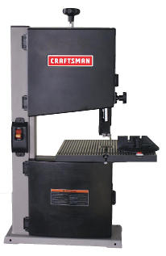

`{{TOCright}}`{=mediawiki}

## Time and Location

:   April 8, 2014
:   Called to order at 20:15 by Dan B.
:   Members present: Dan B, Mirage, Shawn, Ben the Pyrate, Eben, Phil,
    Kevin, Lee, Katie, Hax online, Juri online, ITG online, Dan K
    online, Nell?!?!?!
:   Others present: Bobby, Jamie, Harry, Travis, Robin

```{=html}
<!-- -->
```

:   [Quorum](Quorum)?

    :   Quorum met? Yes.

## Approval of Previous Meeting's Minutes

[Annual Meeting 2014](Annual_Meeting_2014)

## Recognition

-   Everyone involved in moving the Scanning Electron Microscope!
-   Ben Mendis (sitwon) and haxwithaxe for truck driving!
-   Zach for improving CNC mill, Laser Cutter, and 3D printer
    functionality.

## Director Reports

### President's Report

Dan B has been instigating things! He introduced himself to Brian.
They're with Megapath Internet with 3 up and down. Something on
Megapath's end keeps dropping the VoIP traffic. They've been thinking
about switching to Allied Communciations, but they're halfway through
the Megapath contract. Dan talked to Covad and Comcast about business
fiber ethernet to the Internet -- both are extremely expensive. Also,
you're going to get Verizon for the last mile, no matter who you buy
from. If we were to acquire another 15-20 members, we could think about
having awesome internet in the space, providing there's a consensus. USA
SEF and classes this summer could bring in some of these members. The
church may be able to use HacDC's expertise in fixing their organ.
Electricity problem: we have 1920s wiring, sometimes upgraded with 1970s
wiring. The church's fund drive for building maintenance succeeded. We
have 3 new breakers in the hallway panel. We can have 3 new 20-amp
circuits in addition to our existing circuits. Brian would appreciate
our doing the grunt work up to the point where a licensed electrician is
required. Brian also says it would be okay to install more
sound-absorbing panels on our ceiling without getting in trouble with
the fire marshal. Dan has been trying to push people to take some of our
stickers and fliers with them! Let's do more advertising. Let's make an
effort at the USA SEF especially. Dan plans to bring his
3D-scanner-to-plotter setup. Mirage is talking with one of the festival
vendors who seems interested in donating a high-end 3D printer to us
after the festival.

### Vice President's Report

### Treasurer's Report

Here is the financial summary spreadsheet for March 2014:
. We
gained two members in the past month: Christopher Hermance and Kevin
Cole. We lost one member, Alex Stone. We have 48 dues-paying members in
good standing, two permanently dues-waived members, five temporarily
dues-waived members, and three members who are behind on dues.

#### Project Awesome

Here is the Project Awesome spreadsheet for March:
. We
were back to a positive cash flow last month, so I can declare a Project
Awesome dividend of \$300 while adding the remaining \$103.84 to our
unearmarked reserves. There were 14 votes, unchanged from the previous
month.

### Secretary's Report

Absent.

### Director-at-Large Reports

#### Ben

We moved the SEM! It was quite an adventure and I'd like to thank
everyone who helped us out with this.

#### Zach

In Shenzhen.

## [Project Awesome](:Category:Project_Awesome) Reports

### Project LASER

Dan has completely failed to perform the air isolation for the mirrors,
because he was helping with the SEM, then got sick, etc. Still some
vibration on the rastering. Mirage applied some special grease to the
track which will probably help. Still more maintenance to be done. Some
weekend we should rent a truck and go and buy the materials for the
cabinet and build it.

### Project BYZANTIUM

Didn't have much movement in the last month. The Doctor is back in town
this week and they're working on Byzantium again in the evenings. Dan B
has been soaking some of the USB sticks in acetone, removing the
sticker, and finding that they work.

### Project KITBUILD

Absent.

### Project SUPPLIES

Still healthy and stable. Pleased to see this month's expenses almost
exactly matched income. Plan to spend the SUPPLIES fund as necessary to
repair HacDC equipment. So long as we have at least a few hundred
dollars reserve, this includes replacement parts for new equipment like
the SEM.

#### Expenses

-   \$57.95 Dial Test Indicator (Used to level the CNC mill.)
-   \$20.47 Air dusters (General purpose and SEM cleaning supply.)

#### Projected

-   \~\$100 in filament from Microcenter (receipt not yet submitted).
-   \~\$10 LetraTag Material for Label Maker (need to order)
-   \~\$80 in SEM supplies (projected)
-   \~\$80 for EPSON T5646 Light Magenta Ink Cartridge

Some of these may be delayed, due to the \$250 spending limit.

### Project EXPANSION

There have been no objections raised to purchase of a small vertical
bandsaw like this one for less than the existing \$145 budget:



This should be at least as usable as the last bandsaw. Given our present
financial situation, I think we should just get something suitable for
cutting CNC mill/laser cutter stock rather than seek a more expensive
machine.

If there are still no objections, will select the best one within the
current EXPANSION budget, and direct Katie to order it. Preference will
be given to support for cheap, standard blades.

### Project SPACECAM

The baffling idea sounds great. We can mount the newer, cleaner
whiteboards on the wall. Kevin will need help with these efforts. The
big old original whiteboard should be discarded. We received other
donations: an inkjet printer/scanner/fax, a handful of workstations
(Kevin will be installing memory and hard drives so they can be used for
projects), monitors, two projectors (one working, one dead), cable
locks, surge protectors. There's a rollabout cart that works well for
the working projector.

Kevin will talk about community wireless with DC OCTO, which Ben says
has been engaged with several times in the past to be shut down by the
rich telecom lobbyists. Since HARC is providing training for the amateur
radio community, it could be argued that HacDC should be given some
community wireless authority (?) as a public safety support provider.

## Member Reports

### mirage335

#### Prusa Mendel

Was on the fence for a while what to do about this beast. After
approximately 300 hours of work, there was every reason to expect the
last maintenance cycle would be the last. However, multiple spontaneous
failures now cast any plans for long-term stability into doubt. Even if
we actually did stabilize it, the effort would be sunk into a slow
(45mm/s vs. 300mm/s) machine with ever-present alignment issues.
First-layer alignment in particular has been particularly difficult to
maintain to any reasonable degree. The non-linear surface has been
estimated as a 6th order problem.

Current state of the art designs are likely more than an order of
magnitude better, using a 'delta-bot' configuration and highly rigid
construction from aluminum extrusions. Such designs are not subject to
many of the fundamental design flaws our Prusa Mendel suffers:

<https://www.youtube.com/watch?v=PPyet-kDWMQ>

Recommend we either purchase one of these, or direct our efforts away
from 3D printing until we are ready to fully polish off our own designs
(eg. Optical Table, Flex Replicator, etc).

-   \$600 -
    <http://blomker.com/index.php?id_product=28&controller=product> -
    Kit, should contain everything. Lack of heated bed necessitates
    immediate upgrade, but also eases use of a hot-air heat source which
    eliminates PCB warping. Auto-leveling probe by default is
    interesting.
-   \$1000 - <http://seemecnc.com/products/rostock-max-complete-kit> -
    Complete kit, contains everything.
-   \$1400 - <http://seemecnc.com/products/orion-delta-3d-printer> -
    Fully assembled, just works.

Recommend the Kossel mini kit (\$600 + shipping). Julia Longtin (aka.
juri) has expressed an interest in getting it running, in exchange for
taking our Prusa Mendel. That would also give us some hope that it may
become an experimental machine for educational purposes.

**We also have an opportunity to pick-up one of these high-grade
printers for free at USASEF.** Efforts are being made to inform HacDC
BOD and members participating in USASEF.

#### Biosignal Amplifier

As a reminder, fully operational and documented:
<http://wiki.hacdc.org/index.php/Category:BiosignalAmplifier>

#### Photolithography PCB Fab

As a reminder, fully tested, working, and documented:
<http://wiki.hacdc.org/index.php/Category:Photolithography_PCB_Fab>

Need to create a 'photolithography materials' box to keep the equipment
organized and available.

#### SEM Progress

Organized the wiki pages and began research on replacement electronics.
Looks like we need an FPGA managing a bunch of I2S ADC/DAC devices
typically used on high-end 24bit 192kS/s soundcards. Have already
thoroughly investigated the FPGA toolchains, and HacDC should have
already have some usable FPGAs to begin experiments.

#### OpenProjector

Nearly there, another HacDC member has the final Giant Fresnel lens.
Projector construction can commence once lens has been retrieved.

#### Imagnus, Flex Replicator, Optical Table

Still in the same state as last meeting. All in progress.

#### Unnecessary Mess

Spent \>3.5 hours cleaning up work benches at HacDC. Some of the more
egregious problems included a melted space heater plug, still plugged
into a power strip, a messy chemical spill, and misused solder paste
left exposed. In all cases, the responsible parties could have cleaned
up much more easily before leaving.

We can do better, and for a long time we have done better.

This does not concern any new items showing up at HacDC, nor project
SEM, and probably not any other ongoing activity. Looks like someone
using the space couldn't bother to put tools back where they came from
or clean up after their mess. Seriously, who here feels comfortable
leaving the space with a chemical spill on a work table to harden into
sticky residue for the next user? Since I don't know, I can only
politely request it not happen again.

This also goes for anyone administrating HacDC events - please watch
your guests.

#### Cleanup

Literally just disposing of the sheer quantity of e-waste is a problem,
owing to past inability to dispose of junk more frequently. Failing
other options, Waste Management 'dumpster in a bag' is a possibility, at
a cost of approximately \$200 (not recommended).

### Phil Stewart

Gave a tour to some journalism students.

## Old Business

## New Business

Allocate \$750 to purchase and commissioning of a new 3D printer.
Approved.

### Ben

In order to move the SEM I rented a truck and drove it down to Norfolk
and back. I would like to get reimbursed the \$724.94 for the truck
rental. Approved.

## New Members

Harry: has been working on projects on his own but doesn't have much
workspace. Brought a remote-controlled robotic thing to Greenbelt Mini
Maker Faire. Memberified.

Travis: has been coming to the space. Has gotten some help getting
started with Python and getting his PogoPlug server running. He likes
coming here to find out what he'd like to do and then figuring out how
to do it. Memberified.

Robin: video editor. Took Alberto's class last summer. Interested to
bring stuff he's doing with lights and video to HacDC. Memberified.

## Adjournment

Adjourned at 21:55 by Dan B.

[Category:Meeting Minutes](Category:Meeting_Minutes)
