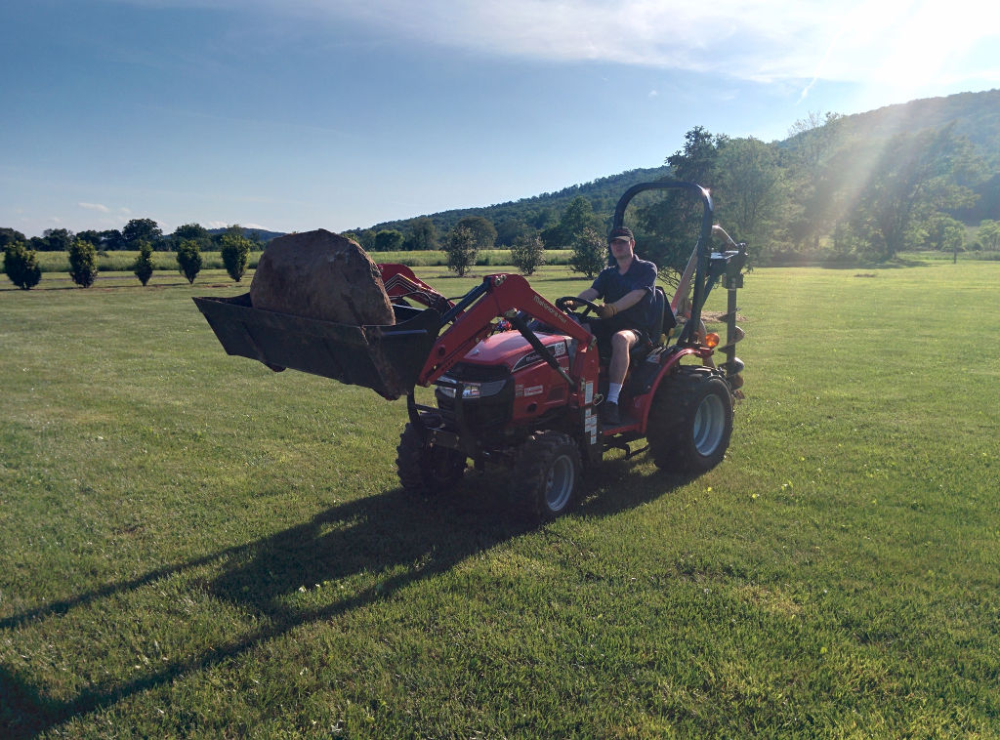

`{{TOCright}}`{=mediawiki}

## Time and Location

:   June 10, 2014
:   Called to order at \_\_\_\_\_\_ by \_\_\_\_\_\_
:   Members present:
:   Others present:

```{=html}
<!-- -->
```

:   [Quorum](Quorum)?

    :   Quorum met?

## Approval of Previous Meeting's Minutes

[Regular Member Meeting 2014 05
13](Regular_Member_Meeting_2014_05_13)

[Regular Member Meeting 2014 04
08](Regular_Member_Meeting_2014_04_08)

## Recognition

-   Martin, for roof expedition and photographic inspection of roof
    antenna condition.
-   Julia Longtin (aka. juri) and Shawn Wilson (aka. AG4VE) for
    continued work assembling and commissioning our new 3D printers.
-   Dan Barlow, Tommy Johnson, and anyone else involved in bringing us
    an engine hoist for deploying the optical table.
-   Zach, for fixing the large TV.

## Director Reports

### President's Report

### Vice President's Report

-   1 server is configured and ready to use
    -   still needs a 3U or smaller PSU \>=500W to be able to close the
        case
-   Wiki and main site experiencing difficulties due to what appears to
    be Dreamhost shared hosting being overrun by something we don't
    control.

### Treasurer's Report

Here is the financial summary spreadsheet for May 2014:
. We did
not gain any new members, and we lost three members: Ann Millspaugh,
Griffin Boyce, and Sharad Satsangi. We have 43 dues-paying members in
good standing, 8 dues-waived members, and 5 members who are behind on
dues.

#### Project Awesome

Here is the Project Awesome spreadsheet for May:
.
Since we had to dip into our savings again (to the tune of \$400+) to
pay our rent, I did not declare a Project Awesome dividend for the month
of May.

### Secretary's Report

### Director-at-Large Reports

#### Ben

#### Zach

## [Project Awesome](:Category:Project_Awesome) Reports

### Project LASER

### Project BYZANTIUM

### Project KITBUILD

Been too busy to begin planning for the HacDC Summer School kit build
but will turn to that soon.

### Project SUPPLIES

Directed Katie to order the following:

-   23mil end mil (for PCB hole milldrilling)
-   Labeling tape for our label maker.

Projected expenses still include:

-   3D printer supplies/parts.
-   SEM supplies/parts.
-   Possibly parts for the optical table if not funded otherwise.

### Project EXPANSION

Have not ordered bandsaw yet, still been busy, still need to confirm
blade compatibility.

### Project SPACECAM

## Member Reports

### mirage335

#### Busy

Have been busy, personally and professionally.



Boulder estimated at 1 metric ton. From buried yard debris to
decoration.

#### OS

Have created a Gentoo/Funtoo ebuild/package overlay incorporating most
of my enhancements. Additionally plan to host more enhancements on a
local server at HacDC. Plan to deploy several laptops with KDE and other
things.

#### Optical Table

Heard we now have the engine hoist at HacDC. Perhaps that could be used
to deploy the table after the meeting.

#### Equipment

Need to make the space inviting, which means fully operational equipment
and cleaned up spaces. To that end, might borrow one of the 3D printers
to try various firmware, and will set up some laptops with usable Linux
software.

### haxwithaxe

#### HARC

-   New ham cart computer
    -   Debian Testing
    -   Shooting for 100% FOSS (not likely but will try)
-   Field Day 2014
    -   14:00 EDT Saturday 28th through 16:59 EDT Sunday 29th.
    -   Lee will be making chilli
    -   <http://www.arrl.org/field-day>
-   Roof hardware
    -   Removing any unused or temporary hardware
    -   Tuner has been nonfunctional so needed to replace it
    -   Adding NVIS antenna
    -   Adding 3GHz routers
    -   Replacing the mast for the existing 2.4GHz router with one for
        the 3GHz and 2.4GHz combined
    -   Making everything more professional looking and adding
        [disruptive
        camo](http://en.wikipedia.org/wiki/Camouflage#Disruptive_coloration)
        (subtle blue, grey, white) to breakup the outline of elements
        visible from the street
-   DC DOH Training - June 20th
-   FCC License exam - Here June 21st - Free

## Old Business

## New Business

## New Members

## Adjournment

Adjourned at \_\_\_\_\_ by \_\_\_\_\_\_\_

[Category:Meeting Minutes](Category:Meeting_Minutes)
