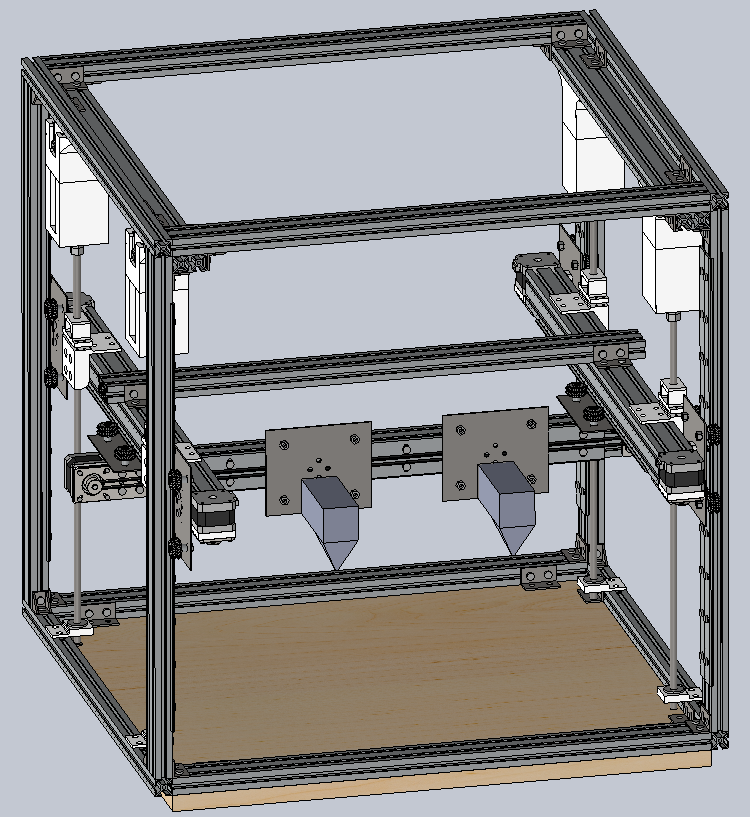

`{{TOCright}}`{=mediawiki}

## Time and Location

:   August 12, 2014
:   Called to order at \_\_8:02\_\_\_ by Dan Barlow
:   Members present: Dan, Evan, Phil, Ben, Travis, Zack, Jamie
:   Members remote: Mirage, Alberto, Chris, Shawn, Justin, Kevin, Juri
:   Others present: Enrique, Reed, Celeste, Phil, Bobby

```{=html}
<!-- -->
```

:   [Quorum](Quorum)? 14/13

    :   Quorum met? Yes.

## Approval of Previous Meeting's Minutes

[Regular Member Meeting 2014 07
08](Regular_Member_Meeting_2014_07_08)

[Regular Member Meeting 2014 06
10](Regular_Member_Meeting_2014_06_10)

[Regular Member Meeting 2014 05
13](Regular_Member_Meeting_2014_05_13)

[Regular Member Meeting 2014 04
08](Regular_Member_Meeting_2014_04_08)

Bulk approval: 7 present vote in favor. 4 remote vote in favor. 11 vote
in favor, motion passes.

## Recognition

## Director Reports

### President's Report

Call to action: We need more emotional awareness in the space. Be aware
of not just ourselves but others. How are others feeling, are they
uncomfortable, are they being made uncomfortable? We need to make sure
people have a good experience, because they have a long memory for bad
experiences.

### Vice President's Report

-   Reminders
    -   LABELS!
        -   bins - what is inside (generally, but create an index if you
            want)
        -   shelves - what goes there and where on the shelf it goes
        -   projects - who is in charge of it, when it is expected to be
            gone by, how to appropriately store it if it hasn't been
            removed by then
    -   SHOP RULES! (i am a bad human)
    -   Bike theft - bypassing locks outside of the space should be
        reported to church security/staff or the police. use your
        judgement when considering calling the police.

```{=html}
<!-- -->
```
-   News
    -   the basement has internets
    -   the basement may have a server in it by the time the meeting
        starts

### Treasurer's Report

Here is the financial summary spreadsheet for July 2014:
. We
gained Ed O'Brien as a new member and regained founder Andrew Righter
(Q). We lost William Gibb, Rob Ryan-Silva, and David Pietrocola. We have
43 dues-paying members in good standing, 7 dues-waived members, and 4
members who are behind on dues.

#### Project Awesome

Here is the Project Awesome spreadsheet for July:
. We
continue to have to dip into savings to pay our rent, so no dividend
this month. :(

### Secretary's Report

Still haven't gotten the paperwork sorted for the SEM. I know I'm
dropping the ball here, I'll get it worked out by tax time or you can
fire me.

There are two major upcoming events.

Making Games with Stencyl is this Saturday.
<http://www.meetup.com/hac-dc/events/197976622/> I've convinced my
friend Alex to come in and teach a one-day class on indie game
development.

The annual HacDC Cryptoparty is September 20th.
<http://www.meetup.com/hac-dc/events/187948232/> There is a lot of prep
and planning to do between now and then. We're hoping to make this year
bigger and better than the previous two. We're still looking for
speakers, so please sign up to give a talk. Even if you don't think
you're an expert, you can probably teach somebody something useful.

If anyone could stay after the meeting to help me load junk into my car
I will take another load to the dump.

Signs for the bathrooms. Do we need to have a vote on this? No vote
needed.

### Director-at-Large Reports

## [Project Awesome](:Category:Project_Awesome) Reports

### Project LASER

Laser is used up, need a new tube. The Laser tube is a consumable which
we will need to replace every couple of years.

Charring is different from vaporizing. If a material chars instead of
vaporizing, then it will stop vaporizing even on successive passes.

We're going to buy a new tube (with matching power supply). New tube
will be twice as powerful.

### Project BYZANTIUM

Not much news in terms of recent development. We have radios installed
on the roof. Frank Sanborn (FEMA) is adapting ByzPi for use monitoring
mudslides. Had some useful discussions with ISC at HOPE, they liked our
performance on the grant, they're going to get us feedback from users in
crisis zones (like Ukraine and Syria). Lots of plans on paper, but the
team is still distracted with other responsibilities.

### Project KITBUILD

No news. Had to take personal time off. Hope to pick up in the Fall.

### Project SUPPLIES

Bought some screws for our optical table. More importantly, we are now
down to a \$849.12 balance. As before, this continued loss of funding is
undesirable and somewhat unexpected given recent publicity campaigns.

### Project EXPANSION

Considering a chop saw, still not sure what to buy.

### Project SPACECAM

## Member Reports

### mirage335

Beginning work on the optical table, example 3D printed mounting
hardware in the basement. Have also repaired one and partially
reassembled one of Dan Barlow's projectors, planning to deploy the
components on the optical table.

#### FlexReplicator

Platform design complete, awaiting construction.

{width="200"}

## Old Business

## New Business

Mirage proposes the following amendment to the [Standing
Rules](Standing_Rules):

:   Effective immediately, quorum is set to ten members. Henceforth,
    when quorum is not met two months in a row, the number of members
    required to meet quorum shall be reduced to the greatest number
    present in any of those months minus one.

Note that amendments to the standing rules require a 2/3 majority vote
of a quorum of members.

7 present vote in favor. 4 remote vote in favor. 11 in favor, motion
passes.

Authorize Dan Barlow to spend available Project Laser funds for repairs,
replacement parts, and upgrades. 7 present vote in favor. 3 remote vote
in favor. 10 in favor, motion passes.

## New Members

Enrique Cobas: Voted in.

Reed: Web programmer. Robotics hobbyist. Interested, but not becoming a
member yet.

Philip Walker: Built a stair climbing robot, has a patent on it. Tired
of doing software, likes hardware. Wants to build stuff on top of the
patent he has, make it open-source. Has a warehouse on W St. that he's
willing to share with us. Has a lab in Adam's Morgan with lots of
fabrication tools too. Want to meet the community and get involved.
Voted in.

Celeste: Specializes in human-computer interactions. Involved in
open-source. Interested in community. Voted in.

## Adjournment

Adjourned at \_\_9:15\_\_ by \_\_\_Dan Barlow\_\_\_

[Category:Meeting Minutes](Category:Meeting_Minutes)
