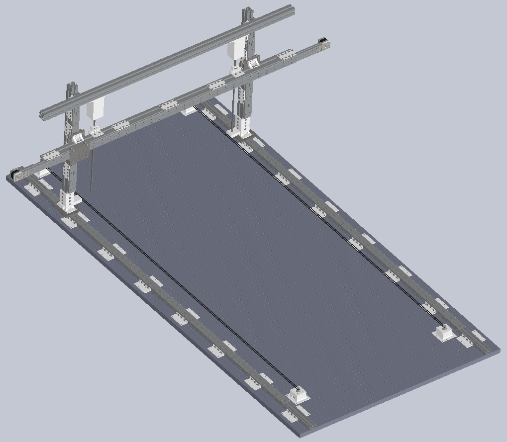

`{{TOCright}}`{=mediawiki}

## Time and Location

:   September 9, 2014
:   Called to order at 7:45\_\_\_\_\_\_ by \_\_\_\_\_\_Dan Barlow
:   Members present:

Dan B member, Lee member , Mirage member, Rob(guest) Katie member, Gary
guest Nell member Jared visiting mike visiting David W guest Pat guest
Phil mem enrique member Online Plasma and Agave hax and ITG gatohaus

:   Members remote:
:   Others present:

```{=html}
<!-- -->
```

:   [Quorum](Quorum)?

    :   Quorum met? yes!

## Approval of Previous Meeting's Minutes

[Regular Member Meeting 2014 08
12](Regular_Member_Meeting_2014_08_12)

## Recognition

-   Dan Barlow - Identifying and obtaining better laser tube.
-   Julia "juri" Longtin - Bringing much needed funding to HacDC
    equipment.

## Director Reports

### President's Report

### Vice President's Report

#### Admin Team

-   CAT6 has been run for several things around the space.
    -   -   3D printer station machine (the cube is directly under the
            switch so we didn't run one for that)
        -   Laser and laser station machine
        -   CNC station machine
        -   Clear modem (we have a plan for load alancing between the
            church and clear within the space)
        -   Ham Desk (includes remote access for the wifi gear on the
            roof)

    -   There will be more but we know these things will be on the wired
        network so we ran cables for them. They are not mounted because
        we had a miscommunication about the available mounting options.
        We want for it to be in conduit but we were hoping to do that
        when the AC electrical is upgraded to coordinate the conduit
        selection. We didn't have a chance to crimp them all before
        leaving. Feel free to crimp (type A wire order) and test them
        tonight. There is a diagram on the crimper and we have ezcrimp
        terminators. El Presidente can give access to those materials
        which are on lone from ITechGeek.

    -   If you want network ports anywhere in particular in the space,
        email
        [admin+icanhazjack@hacdc.org](mailto:admin+icanhazjack@hacdc.org?subject=icanhazjack)
        and we'll take those requests into account when we run more
        cables.
-   We have one of the switches donated by Ahmed on the second to top
    shelf of the set over the main workbench in the workroom. Please try
    to not unplug it for too long or unplug any network cables from it.
    It is a smart switch and the ports in use are mapped to VLANs some
    of those VLANs are setup to restrict access to various things (like
    the mesh and ham radios from the the greater church network). The
    other switch donated by Ahmed is in the network closet of the church
    and is the switch distributing internet to the rest of the church.
-   There is another gigabit smart switch we wanted to put in the
    basement for servers down there. It is currently MIA and help
    finding it would be appreciated. It is a dark blue, half depth
    rackmount, Trednet or Netgear. If you know where it went or where in
    the basement it got too please email
    [admin@hacdc.org](mailto:admin@hacdc.org?subject=found%20network%20switch).

### Treasurer's Report

Here is the financial summary spreadsheet for August 2014:
. We
gained Celeste, Enrique, and Phillip as new members. We lost Ruben
Duque, Elizabeth Smith, Dan Koestler, and Bjorn Westergard. We have 44
dues-paying members in good standing, 7 dues-waived members, and 2
members who are behind on dues.

#### Project Awesome

Here is the Project Awesome spreadsheet for August:
. We
continue to have to dip into savings to pay our rent, so no dividend
this month. :(

### Secretary's Report

I purchased a house this past Wednesday, so I'm busy and not at HacDC
tonight.

I updated the members@ list with the latest regarding the
Hac`<b>`{=html}k`</b>`{=html}DC situation. I will continue to pursue
this issue as discussed with the rest of BoD.

The OpenPGP Card group order has arrived. I will bring the cards/readers
to the Cryptoparty for people to collect their share. If you need it
sooner, you'll need to schedule with me.

I have new signs for the bathrooms, but since I haven't been to the
space in over two weeks I haven't had a chance to put them up. Next time
I'm there I'll get them installed.

I also made ten copies of the space key, because we ran out last month,
but as I haven't been to the space they're not in the BoD locker yet.

While I'm buying stuff for my house, I'll also pick up a replacement
door handle for the pirate bathroom.

If there's anything else, you can call me up, but my phone currently
gets no service in my new basement so don't be offended if I don't pick
up, it probably means my phone didn't ring.

### Director-at-Large Reports

## [Project Awesome](:Category:Project_Awesome) Reports

### Project LASER

### Project BYZANTIUM

We basically blew off yet another sprint last month because I was busy
with the Crab-B-Q. (By the way, you can totally cook crabs in a smoker.)

We are slacking and we really need to pull it together soon. I'm just
having trouble making time for things.

### Project KITBUILD

Project KITBUILD's shepherd has been out of commission all Summer but
hopes to be able to get something together in late October or November.

### Project SUPPLIES

Have a \~\$50 receipt for various screws purchased from Fastenal, mostly
for the optical table.

### Project EXPANSION

For lack of incoming funding, the project coordinator (mirage335) feels
that any purchase made from these funds must be well planned.

### Project SPACECAM

## Member Reports

### mirage335

{width="400"} Finally
designed the [OpticalTableRobot](OpticalTableRobot). Similar
to the FlexReplicator, supports multiple tools simultaneously. However,
this platform is far more rigid (absolute accuracy expected to be \<2um
across the \~8'x4' work area). Surprisingly, it is also cheaper than a
FlexReplicator, thanks to the free table and extrusions.

Julia Longtin has successfully sought investors, and plans to use the
robot to manufacture large car parts.

## Old Business

## New Business

## New Members

Jared Nielsen Gary approved

## Adjournment

Adjourned at \_\_\_8:46PM\_\_\_\_ by \_\_\_\_\_\_\_\_\_Dan Barlow

[Category:Meeting Minutes](Category:Meeting_Minutes)
