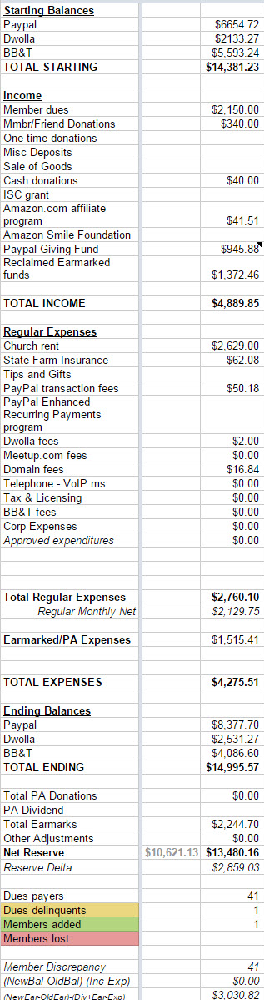
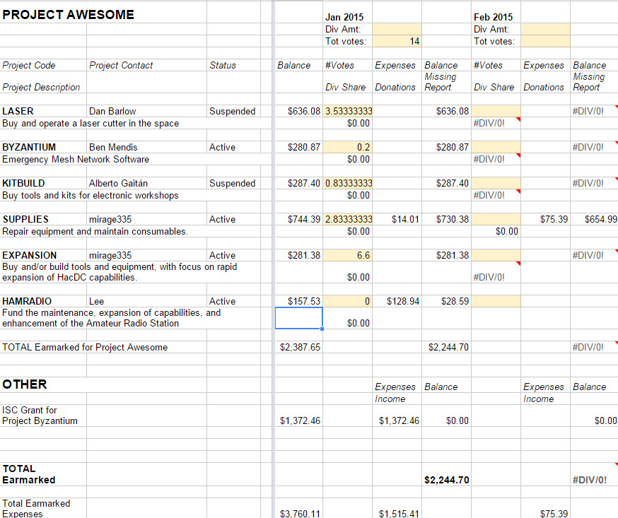

`{{TOCright}}`{=mediawiki}

## Time and Location

:   February 10, 2015
:   Called to order at 8pm by Travis B.
:   Members present: Travis, Enrique, mirage, Ben, Julia, Bill B., ...
    hm, should have kept track of names better. But 12 members.
:   Members remote: Hunter, ITechGeek
:   Others present: James

```{=html}
<!-- -->
```

:   [Quorum](Quorum)?

    :   Quorum met? Yes, 12.

## Approval of Previous Meeting's Minutes

[Regular Member Meeting 2014 12
09](Regular_Member_Meeting_2014_12_09)

## Recognition

-   Julia Longtin, et al. - Much work on the 3D printer, space cleanup,
    equipment salvage, and other things.
-   Ben "sitwon" Mendis and James - IR thermometers much appreciated.

## Director Reports

### President's Report

Shed Media contacted HacDC about a Television show on January 14 2015.

-   Spoke to Shed Media about their interest in HacDC for a
    reality/educational television show on Feb 3 2015.
-   Shed Media develops concepts for TV shows and sells them to networks
    and they want to explore a Mythbusters-type show (6-8 episodes about
    the same space) on Hacker/Makerspaces. They want to show interesting
    people making cool things in a way that will be entertaining and
    educational to viewers.
-   They got our name from Mitch? at Noisebridge (San Francisco) and are
    talking to other spaces. I also gave them the names of Reverse
    Space, Unallocated Space, and Baltimore Node.
-   If this goes all the way, it will require a large and long time
    investment by those involved and will be a huge disruption on the
    space for the duration of the project. However, the space and the
    people involved will make some money.
-   The next step is for interested people to talk to Shed Media.

Thusfar, no one has expressed an interest in participating. If I don't
see/hear from anyone by the end of the week, I will tell Shed Media that
HacDC is not interested.

### Vice President's Report

-   

### Treasurer's Report

-   These are the financial logs of the HacDC enterprise

\+ We have a Net Zero on memberships gain/loss for the month + We netted
an additional \$614.34 due to membership catch-up payments and donations

Will be looking into money saving through advanced payment of the
Insurance. Look out for an email tomorrow morning asking everyone to
either switch to Dwolla for their payments to HacDC (Lower fees
25¢-Dwolla vs \$1.25-Paypal). If everyone switched to Dwolla that would
result in about an extra \$50. Sorry it's taken so long to get this out.


#### Project Awesome

-   

There was an error in the Financials spreadsheet during the record
transfer of Earmarked accounts from 2014 to 2015 that resulted in the
cancellation of an order from Amazon being cancelled due to what seemed
like insufficient funding. That error has been corrected and is
reflected in the current Earmarked account statement.



------------------------------------------------------------------------

Teaching for Change made a donation to HacDC for \$150 after a member,
ITechGeek, stopped by and helped them sort out their phone lines. Julia
(Juri) has requested some parts for the giant robot being built on the
optical table downstairs. It has been stalled due to our recent funding
woes. The current need for the project downstairs are at least 24
V-wheels from open build. They are \$3.50 each. If anyone would like to
either purchase the whole lot or sponsor a few of those wheels please
send an email to the members list. Also, If anyone has any supplies from
Amazon, that need to be ordered please shoot treasurer@hacdc.org an
email. There is a Project Supplies order that doesn't meet the minimum
purchase for shipping requirement at the moment.

### Secretary's Report

-   

The internet security workshop was January 24. About half of the 40+
RSVPs attended. Not sure if it resulted in any new memberships but
several attendees said they would stop by later to check out the space.
We covered a lot of good topics and went from about 3:45 to 8pm and then
stayed about another hour after that discussing more. Thanks to Xavier
for several topics he covered. See email for other details. He has put
his slides online and I haven't gotten around to cleaning them up yet,
so they aren't online yet.

I stopped by NoVA Labs recently to check out what they're doing. They're
still in the process of moving to a very large space. Their front room
is more or less finished but the classroom, kitchen, workshop, laser
cutter room and more are still under construction. They have both a
large CNC and a laser cutter but both are offline for now / still being
installed. The workshop area is huge (they advertise 10,000sqft total,
so about 10 times our upstairs space). They also have office space for
about 5 incubator / start-up companies which are all currently rented
out and serve as a source of income. The companies benefit from access
to the space. I was told their membership is about 60 but they have a
tiered structure so I'm not sure if that referred to \$100/mo full
membership or the \$50/mo associate level (which we basically give away
for free). They still have a negative cashflow, especially with the new
construction. They also have a policy that nomination and fees are not
enough to warrant membership; they expect some contribution to the
organization first. They also charge cost-recovery fees for large tools
like the laser cutter and CNC. Might be worth comparing/contrasting the
two organizations to see if we can learn anything from each other.

### Director-at-Large Reports

-   

## [Project Awesome](:Category:Project_Awesome) Reports

### Project LASER

-   

### Project BYZANTIUM

-   

### Project KITBUILD

-   No news to report.

### Project SUPPLIES

-   Thoroughly needed replacement soldering iron tips have been
    requested, and ordered at a cost of \~\$70.
-   Fresh cleaning supplies for the Rostock Max (and 3D printer glass
    generally) have been requested, but not ordered.

A "clerical error" was reported earlier today.

### Project EXPANSION

Planning a \~\$90 expenditure for OpticalTable V-Wheels.

### Project HAMRADIO

-   

## Member Reports

### mirage335

#### VP Candidacy

Would like to run for the Vice President position. Wrapping up a major
project soon, and seems time I committed more time to HacDC's
educational and technological missions.

#### 3D Printer

Please, do not introduce food or finger grease to the 3D printer glass.
Some unknown contaminant has proven extremely tough to remove from the
glass. Additionally, the extruder is also dripping oil, suggesting
ongoing contamination upstream. This is more recent, and definitely
unrelated to, any CNC mill oiling.

#### Other Things

Although delayed a few weeks by another project, the RFID reader system
is still underway. Have just constructed a new workbench at home, which
should greatly improve my ability to clear off projects like this.

Optical Table Robot construction is apparently going well. Many thanks
to other participants on this project.

## Old Business

-   

## New Business

Is this in the right section? This is my first time entering minutes
here.

Julia reports we need 24 V-wheels at \$3.50 each for the giant basement
robot, donations towards that purpose would be very welcome.

Don is signing up for the April grant writing class; will report back
next month. Don also reminded everyone of tomorrow's Amateur Radio club
meeting, with a guest speaker from VOA, and the raffle of a handheld
transcevier.

Travis will look into registration of HacDC as a non-profit in D.C.,
which is separate from our IRS status.

Ben expects a box of Project Byzantium gear, including a MacBook, mailed
back to him / HacDC shortly. May also put together a HacDC camping trip
this year.

Reminders of the upcoming Raspberry Jam (condew) and SpaceBlimp6 team
(Travis).

Enrique received a hardcopy of the original HacDC bylaws with signature
list from Dan.

Hunter (IRC) reminded everyone that Radioshacks are closing and
liquidating inventory cheap.

We had an election for the vacant post of Vice President (who is also
communications / IT organizer). Secret ballots were counted, including 3
votes via IRC and 1 via proxy. The results were: **Mirage (7 votes),
Shawn (6 votes), Bill (2 votes). Congratulations to our new VP,
Mirage.**

## New Members

-   

uberdog (on IRC tonight)

## Adjournment

Adjourned at 21:18 by Travis

[Category:Meeting Minutes](Category:Meeting_Minutes)
