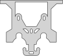
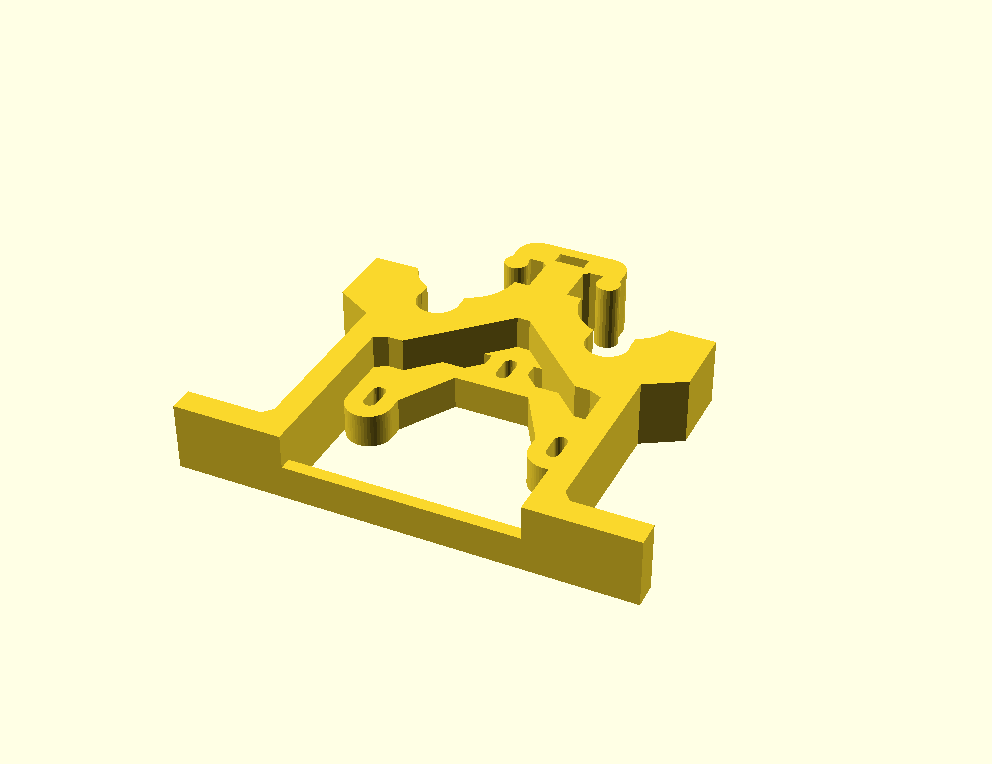

#### Written by Ubuntourist (Kevin Cole) 2017.08.18 {#written_by_ubuntourist_kevin_cole_2017.08.18}

Suppose you have an STL for a part to be 3D printed. In this case, an
**HST double bolt bowden extruder V4 assembly** downloaded from:
<https://www.thingiverse.com/thing:515747/>

 (Click the image for a
larger view. For the full 360, watch the
**[movie](:media:bowden.ogv)**.)

Sadly, these are impossible to work with. At least, with Free / Libre
Open Source Software (FLOSS).

## Prerequisites

You should be able to repeat the whole process below and beta-test my
documentation. The prerequisites are:

-   the Thingiverse STL file,
-   [OpenSCAD](http://www.openscad.org/) (I don't know how well
    [ImplicitCAD](http://implicitcad.org) handles the importing and
    exporting needed, but it's well worth exploring.),
-   [FreeCAD](https://www.freecadweb.org/),
-   a basic familiarity with primitive shapes, transformations,
    differences and unions in OpenSCAD. If those mean nothing to you,
    get thee hie to the [OpenSCAD
    manual](http://www.openscad.org/documentation.html) and read up.
-   and, of course, the One True Editor. ;-) Actually, I may write a
    Python program to automate the editing.

## Stupid pet tricks with OpenSCAD

-   These next three lines import and flatten the STL. The result can be
    exported as SVG, DFX, or any of several other formats. I saved the
    result as both **bottom.svg** and **bottom.dfx**.

`   projection()                         // Flatten`\
`     translate([0, 0, -10])             // The original STL appeared "hover" mid-air. This brought it back to earth.`\
`       import("assembly_v4_rev3.stl");  // STL unzipped from the Thingiverse download.`

:   resulting in:

 (Note: This is an SVG rather than a DFX,
but the concept / result is nearly the same.)

-   The DFX (at least) can be read in again and extruded:

`   linear_extrude(height=10)`\
`     import("bottom.dxf");`

-   Since the object in question changes shape at different "heights"
    several layers need to be cut away in order to get a newer shape. In
    OpenSCAD this is done by creating another shape and subtracting it
    from the initial shape with a difference() operation. I leave it as
    an exercise for the reader to choose a reasonable cut-away. (I think
    I used a 160 x 160 x 10 cube translated to encompass the entire
    bottom of the object.)
-   Unfortunately, operations like **difference()** on STL files can go
    wrong because STL files are often produced sloppily. Fortunately
    [FreeCAD](https://www.freecadweb.org/) is one of the programs that
    can repair STL files. See [Sli3r's page on repairing
    models](http://manual.slic3r.org/advanced/repairing-models) for
    instructions. (The STL file used in this document had to be
    iteratively repaired multiple times before FreeCAD reported no
    errors.
-   Although extruding imported DXF files works after a fashion, it's
    still not really editable source code. It ain't pretty, but there's
    a fix for that as well. The SVG produced from the **projection()**
    and export is a series of polygons, each of which is a series of
    point coordinates. Look at the **path** element of the SVG
    (word-wrapped from the original, for your pleasure):

```{=html}
<svg width="108" height="96"
         viewBox="-62 -50 108 96"
         xmlns="http://www.w3.org/2000/svg"
         version="1.1">
```
`   ``<path d="M x1,y1 L x2,y2 L x3,y3 ... L xN,yN z
             M x1,y1 L x2,y2 L x3,y3 ... L xN,yN z
                 ...
             M x1,y1 L x2,y2 L x3,y3 ... L xN,yN z"
          stroke="black" fill="lightgray" stroke-width="0.5">`{=html}\
`   `

```{=html}
</svg>
```
-   OpenSCAD polygon definitions are lists of points enclosed in
    brackets \[point, point, point, ..., point\]. Each point is an X, Y
    coordinate pair, also enclosed in brackets \[X,Y\]. So, the full
    shape looks like \[\[X,Y\], \[X,Y\], \[X,Y\], ..., \[X, Y\]\].
-   Edit the SVG with the following rules:
    -   The opening and closing **svg** tags at the beginning and end of
        the file should be removed as should the **stroke="black"
        fill="lightgray" stroke-width="0.5"** attributes at the end of
        the **path** element. Really, everything except the contents of
        the **d** attribute of the **path** element should be stripped
        away -- although the **viewbox**, **height** and **width**
        attributes in the initial opening **svg** tag may offer further
        clues at a later date.
    -   **M** are **move to** (pen up) command and marks the start of a
        **polygon**. Convert them to **polygon(\[**
    -   **L** are **line to** (pen down) command. Eliminate them -- but
        not the coordinate pairs that follow each of them.
    -   number pairs are X and Y coordinates and should be enclosed in
        brackets and all but the last should be followed by a comma.
        **\[X,Y\],**
    -   **z** finishes off the current polygon. Convert each to **\]);**
-   The result should be:

`   polygon([[x1, y1], [x2, y2], [x3, y3], ... [xN, yN]]);`\
`   polygon([[x1, y1], [x2, y2], [x3, y3], ... [xN, yN]]);`\
`       ...`\
`   polygon([[x1, y1], [x2, y2], [x3, y3], ... [xN, yN]]);`

-   I suspect, in general, the first polygon will be the general
    outline, and the subsequent polygons will be "holes" in the shape.
    So, surround the whole thing with a **difference()** and add a
    linear_extrude() to get some height:

`   linear_extrude(height=10) {                               // e.g. 10mm high`\
`     difference() {`\
`       polygon([[x1, y1], [x2, y2], [x3, y3], ... [xN, yN]]);`\
`       polygon([[x1, y1], [x2, y2], [x3, y3], ... [xN, yN]]);`\
`           ...`\
`       polygon([[x1, y1], [x2, y2], [x3, y3], ... [xN, yN]]);`\
`     }`\
`   }`

-   Voila! Done! You now have a parametric representation, albeit an
    ugly, incomplete one, of what was once an STL file.

There's still a LOT of work to be done for holes that are not completely
vertical. Completely horizontal holes are gonna be a BITCH! In fact any
odd changes in the Z direction will be trouble. Some of that trouble can
be solved by more difference() stanzas in the original STL, while others
may be ferreted out by 90° and 180° rotations along various axis,
possibly combined with difference().

The end result, produced by
**[fullish.scad](:File:Fullish.scad)** (the combination of
bottom.scad and top.scad):



------------------------------------------------------------------------

--[Ubuntourist](User:Ubuntourist)
([talk](User_talk:Ubuntourist)) 08:20, 18 August 2017 (PDT)
