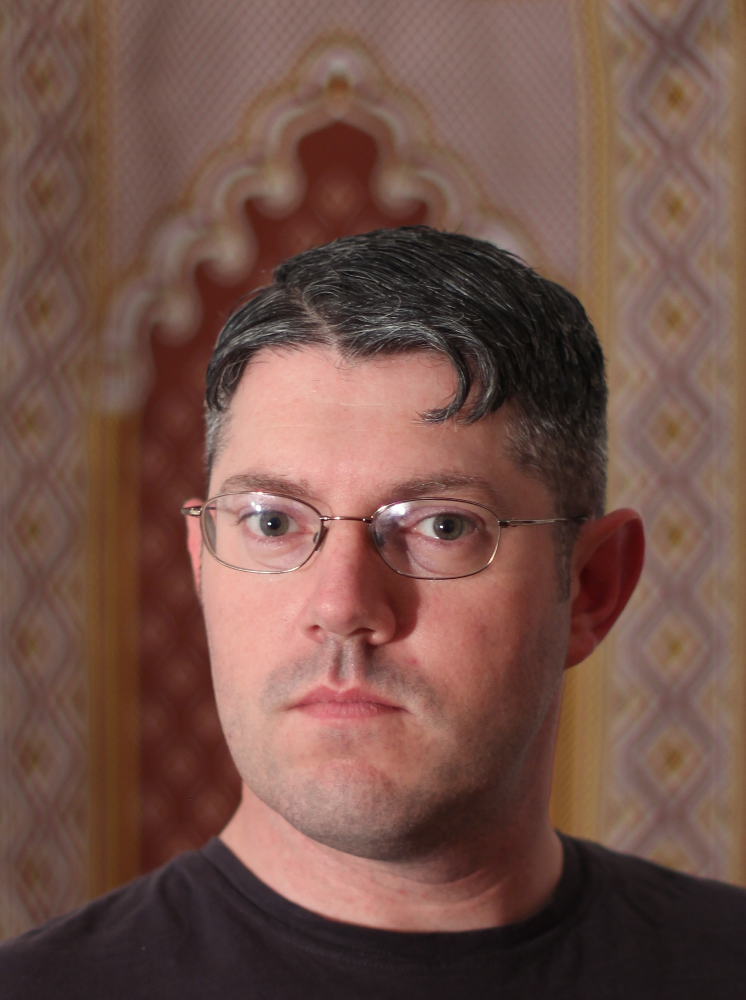
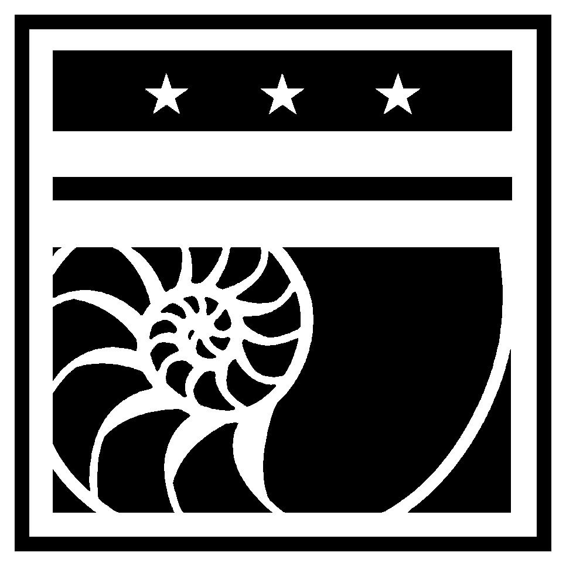
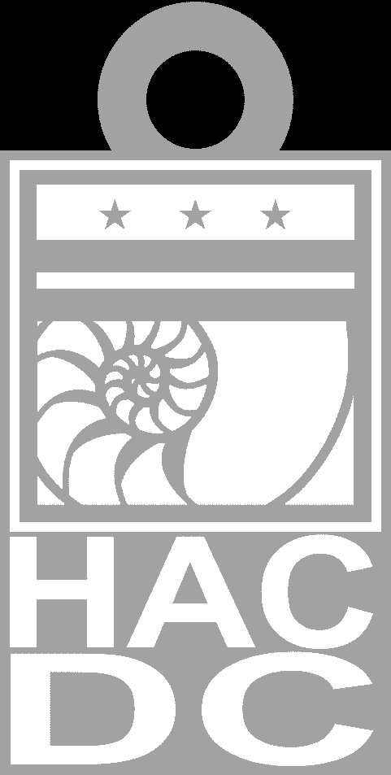

I'm working on getting the [Cheap
Chinese Laser](Cheap_Chinese_Laser) working again. I like
designing utilitarian objects. My motivation to fix the laser is so I
can make a holder for my pens at work. Aside from hacking together
useful things via CNC machines, I like hacking in the kitchen and am
known for my award winning experimental pies. Who needs raspberry when
you could have custard instead? I'm a temporary resident of Hyattsville,
so if you need a lift in that direction, hit me up. BTW, ladies, he's
single.

//HacDC logo key fob //created by James Sullivan //2-10-17 //Openscad
version 2015.03-1 //dimensions in millimeters phi = 1/2+sqrt(5/4);
//x:y=y:x+y thick=2.5; //thickness of base and key ring loop hole=5;
//inner diameter of key ring loop: outer diameter is twice this, wall
thickness is half this high=1; //height of logo and text above base
width=25; //width of tag, height is proportional \$fn=60; color("blue"){
//base translate(\[0,width\*(1-phi),-thick\])
scale(\[1,phi,thick/width\]) cube(width,center=false); //key ring loop
difference(){ translate(\[width/2,width+hole/2,-thick\])
cylinder(h=thick,d=2\*hole);
translate(\[width/2,width+hole/2,-thick\*1.5\])
cylinder(h=2\*thick,d=hole); } } //HacDC logo translate(\[0,0,high\])
scale(\[width/966,width/966,(high+thick)/100\])
surface(file="C:\\\\Users\\\\p007383b\\\\Documents\\\\Personal\\\\OpenSCAD\\\\HacDC-logo2.png",
convexivity=14,center=false, invert=true); //HAC letters
//translate(\[width/2,-width/4/phi,high/2\])
linear_extrude(height=high,center=true)
text("HAC",font="helvetica",size=width/phi/2,halign="center",valign="center");
//DC letters //translate(\[width/2,-width\*3/4/phi,high/2\])
linear_extrude(height=high,center=true) scale(\[phi,1,1\])
text("DC",font="helvetica",size=width/phi/2,halign="center",valign="center");
module D(r){ scale(\[1/r,1/r,1\]) linear_extrude(height=1,center=true)
union(){
polygon(\[\[-r/2,-r/2\],\[0,-r/2\],\[0,1-r/2\],\[1-r/2,1-r/2\],\[1-r/2,r/2-1\],\[0,r/2-1\],\[0,r/2\],\[-r/2,r/2\]\]);
difference(){ circle(d=r,center=true);
circle(d=r-2,center=true);translate(\[-r,0,0\])square(r\*2,center=true);
} } } module C(r){ scale(\[1/r,1/r,1\])
linear_extrude(height=1,center=true) difference(){
circle(d=r,center=true); circle(d=r-2,center=true);
translate(\[r/4,0,0\])square(r/2,center=true); } } module H(r){
scale(\[1/r,1/r,1\]) linear_extrude(height=1,center=true)
polygon(\[\[-r/2,-r/2\],\[1-r/2,-r/2\],\[1-r/2,-1/2\],\[r/2-1,-1/2\],\[r/2-1,-r/2\],\[r/2,-r/2\],\[r/2,r/2\],\[r/2-1,r/2\],\[r/2-1,1/2\],\[1-r/2,1/2\],\[1-r/2,r/2\],\[-r/2,r/2\]\]);
} module A(r){ scale(\[1/r,1/r,1\]) linear_extrude(height=1,center=true)
polygon(\[\[-r/2,-r/2\],\[1-r/2,-r/2\],\[1-r/2+(r-2)\*(r-1)/4/r,-1\],\[1-r/2+(r-0)\*(r-1)/4/r,0\],\[0,(r/2-1)/(r-1)\*2\*r-r/2\],\[-1+r/2-(r-0)\*(r-1)/4/r,0\],\[1-r/2+(r-0)\*(r-1)/4/r,0\],\[1-r/2+(r-2)\*(r-1)/4/r,-1\],\[-1+r/2-(r-2)\*(r-1)/4/r,-1\],\[r/2-1,-r/2\],\[r/2,-r/2\],\[1/2,r/2\],\[-1/2,r/2\]\]);
} translate(\[width/6+.2,-width/phi/4,high/2-thick/2\])
scale(\[width/3\*0.9,width/2/phi\*0.9,high+thick\]) H(7);
translate(\[width/2,-width/phi/4,high/2-thick/2\])
scale(\[width/3\*0.9,width/2/phi\*0.9,high+thick\]) A(7);
translate(\[width\*5/6-.2,-width/phi/4,high/2-thick/2\])
scale(\[width/3\*0.9,width/2/phi\*0.9,high+thick\]) C(7);
translate(\[width/4,-width/phi\*3/4,high/2-thick/2\])
scale(\[width/2\*0.9,width/2/phi\*0.9,high+thick\]) D(7);
translate(\[width\*3/4,-width/phi\*3/4,high/2-thick/2\])
scale(\[width/2\*0.9,width/2/phi\*0.9,high+thick\]) C(7);

STL file of key fob is available as a zip file here:
. Dimensions in millimeters: 25 wide,
40 tall, 2.5 thick. The above code causes Openscad to hang, so the STL
was created using the surface command and a single full length image.
Image could use some tweeking at the pixel level.

[Category:Members](Category:Members)
