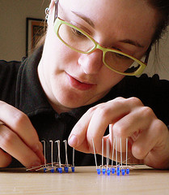

Hi, I'm Katie. By day—and sometimes by night—I
help operate a spacecraft called [New
Horizons](http://pluto.jhuapl.edu/). My background is in computer
science, and I've written some of the software running on [New
Horizons](http://pluto.jhuapl.edu/) and on
[MESSENGER](http://messenger.jhuapl.edu/). Outside of work I enjoy sea
kayaking, sewing and embroidery, using Linux, learning Japanese language
and [tea ceremony](wikipedia:Japanese_tea_ceremony), reading,
hobby electronics projects, nature... all kinds of stuff. I coordinate a
semi-active [DC-area chapter of LinuxChix](http://dc.linuxchix.org/).
Readers of this page may be particularly interested in [my tech projects
page](http://hoteldetective.org/katie/tech_projects.php). Since I live
out in the Maryland suburbs, I'm not physically present at
[hackerspaces:HacDC](hackerspaces:HacDC) often. Feel free to
[e-mail me](mailto:bokunenjin@gmail.com).

## HacDC Projects {#hacdc_projects}

-   Geeks & Depression meetup - see [Mitch's
    tips](http://lists.hackerspaces.org/pipermail/discuss/2011-December/005341.html)
    -   looks like The Doc's got this one going
-   making contacts with amateur radio satellites
-   [geek feminist ally
    training](http://geekfeminism.wikia.com/wiki/Allies_training)
-   reviving [LightningTalks](LightningTalks); see [Jacob's
    request for
    talk-sharing](http://lists.hackerspaces.org/pipermail/discuss/2011-December/005370.html)
-   [Smart Clothing](Smart_Clothing)
-   I'm planning an [LED Embroidery](LED_Embroidery) workshop
    for sometime...
-   making a HacDC stamp for the [Hackerspace
    Passport](https://noisebridge.net/wiki/Passport) using our [CNC
    Mill](CNC_Mill)
    -   should it look like a "real-world"
        \[<https://www.google.com/search?tbm=isch&hl=en&source=hp&biw=1057&bih=887&q=passport+stamp&gbv=2&oq=passport+stamp&aq=f&aqi=g10&aql=&gs_l=img.3>..0l10.1350l3288l0l3644l14l10l0l0l0l0l310l1687l2j6j1j1l10l0.&safe=active#q=passport+stamp&hl=en&safe=active&gbv=2&tbm=isch&bav=on.2,or.r_gc.r_pw.r_cp.r_qf.,cf.osb&fp=abd37d7bac790358&biw=1345&bih=697
        passport stamp\]?
    -   [the flickr hackerspace passport
        pool](http://www.flickr.com/groups/1718510@N24/) has some good
        examples

## Wiki to-do {#wiki_to_do}

-   consolidate [Inventory](Inventory) and
    [Stuff](Stuff)
-   [Inventory](Inventory) probably shouldn't include Skills
-   [Wishlist](Wishlist) and
    [Procurement](Procurement) (not to mention
    [Inventory](Inventory)) look like they need to be updated
-   ~~considering installing
    [Extension:ReCAPTCHA](http://www.mediawiki.org/wiki/Extension:ReCAPTCHA)~~
-   look into creating
    [template](http://meta.wikimedia.org/wiki/Help:Template)s for things
    like meeting agendas and minutes
-   add to [hackerspaces:HacDC](hackerspaces:HacDC)
-   set up Flickr extension as at [nycr:Flickr](nycr:Flickr)

## Mailing Lists to-do {#mailing_lists_to_do}

-   check to see that each list (including project ones) has an admin to
    take care of pending requests

[Category:Members](Category:Members)
