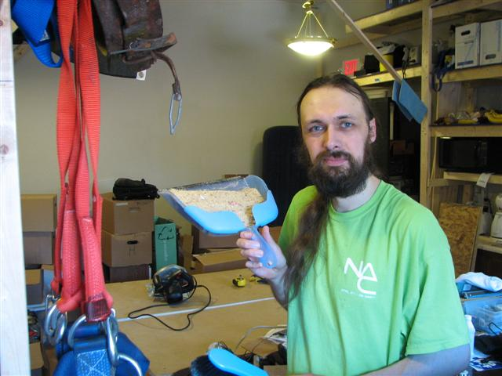

I'm [Nate](https://www.i3detroit.org/wiki/User:Nbezanson). I'm from
Detroit. While I was in town, I worked on on shelving, storage,
organization, and general physical infrastructure for HacDC. I built the
shelves above the sink and behind the door in the old space, and I built
the elevating whiteboard/screen setup at the front of the room. I'm back
in Detroit now, but hope to visit again soon.

Since leaving HacDC, I tried and failed to start
[one](https://wiki.hackerspaces.org/The_Detroit_Facility) hackerspace in
Detroit, but got involved in
[another](https://wiki.hackerspaces.org/I3_Detroit) which is [pretty big
now](https://www.i3detroit.org/wiki/In_the_Media). HacDC members are
welcome to swing by and meet us, if you're in the area.

## Experience and expertise

-   Telecomm
    -   Central-office installation practices
    -   Digital cross-connects
    -   SONET
    -   CDMA cellular infrastructure
-   General electronics
    -   Kit-building
    -   Laptop modding
-   Ham radio
    -   Extra-class license holder, just because
    -   Never made a contact under part-97 rules
    -   Part-15 has plenty of fun toys, thanks
-   Vehicle electronics stuff
    -   CANbus et al.

## Motivations

-   Bragging rights
-   Deadlines
-   Elegance

## Kryptonite

-   Paperwork
-   Dietary fat
-   High expectations
-   Gravity

## Favorite stuff

-   My bookmarks: <http://del.icio.us/myself248/>

[Category:Friends](Category:Friends)
