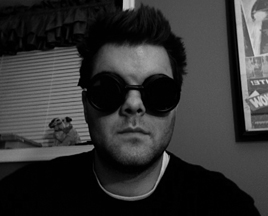

## Andrew Q Righter

### Security Researcher

Experience:\
o Website Development Level: Advanced Note: Really don't enjoy doing
this stuff anymore

`    o Web Application Development Level: Intermediate     Note: Don't enjoy doing this stuff anymore`\
`    o Graphic Design              Level: Advanced         Note: Don't enjoy doing this stuff anymore`\
`    o Digital Media               Level: Intermediate     Note: Don't enjoy doing this stuff anymore`\
`    o Programmer                  Level: Intermediate     Note: Python and C seem to be the languages I use most`\
`    o Network Security            Level: Intermediate     Note: It's what pays the bills (most of them anyway)`\
`    o Electronic Engineering      Level: Intermediate     Note: EE FTW!`\
`    o Machinist                   Level: Intermediate     Note: Trying to get access to a machine shop in D.C.`\
`    o Reverse Engineering         Level: Beginner         Note: Trying to get someone to teach a course on this subject.`\
`    o Wireless Hacker             Level: Advanced         Note: Will teach anyone how to pwnz the APz`\
`    o Lockpicker                  Level: Intermediate     Note: Severely out-of-practice but I can still teach`\
`    o Electronic Security         Level: Intermediate     Note: Will be giving my Blackhat training at HacDC before/after`\
`    o Gamer                       Level: Advanced         Note: Will teach anyone how to pwnz noobs`\
`    o Telco                       Level: Chicken Noob     Note: Trying to get someone to teach me more`\
`    o HAM Dork                    Level: Chicken Noob     Note: Trying to get someone to teach me more`

OS Choice:\
o Linux (Slackware, Ubuntu)

`    o Mac     (OSX)`\
`    o Windows (XP Professional)`

Current Interests:\
o Hardware

`    o Tools`\
`    o Machining`\
`    o Building labs`

Projects:\
o Physical Access Control Thingy

`    o MAME Cabinet Build`\
`    o Robotic Arm Development (Codename: Butterfingers)`

Conferences:\
o **HOPE 2006** New York City, New York - TOOOL US lockpicking training

`    o `**`Defcon 2007`**` Las Vegas, Nevada               - Wireless Village (setup | ran wireless hacking contest)`\
`    o `**`Hack in the Box 2007`**` Kuala Lumpur, Malaysia - Spoke about the insecurities of RFID`\
`    o `**`HackCon 2008`**` Oslo, Norway                   - Spoke on electronic security and DIY ideas for hobbyists`\
`    o `**`Blackhat 2008`**` Las Vegas, Nevada             - Will be training students about electronic security exploits`\
`    o `**`Hack in the Box 2008`**` Kuala Lumpur, Malaysia - Will be training students about hacking the RF spectrum (802.11, RFID)`

[Category:Friends](Category:Friends)
