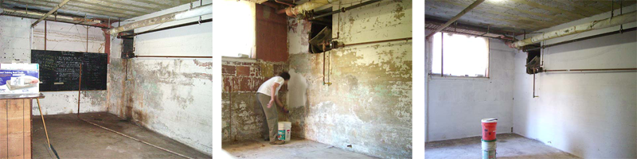

# Renovation Effort {#renovation_effort}

On Saturday, 20 December 2008, [Nate](User:Myself) is
coordinating an intensive effort to renovate the basement workshop-to-be
space. Sign up here for a shift (maximum two people in addition to
[Nate](User:Myself)). If you are wiki-illiterate, just leave
a comment somewhere on this page and we'll add you to the table below.

  Time Slot           Helper One   Helper Two
  ------------------- ------------ ------------
  10 a.m. to 1 p.m.                
  1 p.m. to 4 p.m.    Ben          
  4 p.m. to 7 p.m.                 

February 2009 Update [Dan Barlow](User:Myself):

:   Front room pressure washing is complete. Two walls have been
    drylok'ed. Waiting for more Drylok.
:   Back room has been pressure washed, needs some peelaway application
    to get more paint off and then cleaning/degreasing. Intent is to
    drylok this space as well.



# Paint removal {#paint_removal}

The walls are covered in pretty nasty old paint, much of which is
already flaking off. We presume at least some layers contain lead.
Wirebrushes and scrapers are the preferred tool to remove this without
turning it to powder in the process.

Nick says:

:   I believe the last, best proposed solution for the lead paint
    mitigation, based on Martin's experience and some other research
    that I've seen is to use [a chemical peel and paper based
    solution](http://www.dumondchemicals.com/html/peelaway.htm). This
    also minimizes the risk to those doing the work and helps enable
    proper hazmat disposal.

Dan Barlow says:

:   I tested four different colors of paint in the space with a lead
    test kit. All tested negative. I verified the validity of the test
    by swabbing some solder, which turned it red. The large majority of
    the loose paint was removed by pressure washing, and we will use the
    peelaway that was provided. After preparation, the walls are being
    coated with drylok
    <http://www.ugl.com/drylokMasonry/masonryWaterproofer/latex.php> and
    the floor could benefit from coating as well -- considering \[epoxy
    \| porch paint \| concrete sealer\].

# Asbestos encapsulation {#asbestos_encapsulation}

A large steam pipe runs the length of the room, near the ceiling. It is
wrapped in mineral wool insulation, presumed to be asbestos. The EPA has
changed its tune on this in recent years, and now recommends
professional contractors be used for even the most minor of repairs, but
I (Nate) am comfortable following the old guidelines, to encapsulate the
fibers with latex paint, which is very effective at keeping them from
getting into the air.

Nick says:

:   As far as the asbestos pipe, the best solution I've heard so far
    from a few sources is to cover it with a plywood sheath. As there
    will probably be a lot of stuff moving around down there, the odds
    the pipe will get inadvertently hit are high enough to warrant a
    more structurally protective solution. The big problem with asbestos
    is disturbing it, puncturing any sheath we put around it, etc. Given
    we have the materials to do it (the wood we have left over from the
    loft).

Dan Barlow says:

:   There are two leaks in the steam system in the space. Right at the
    ceiling radiator valve is the worst one, which drips boiling water
    on you. The other appears to be a minor leak in the steam delivery
    pipe just before it goes into the tunnel. This has messed with the
    pipe insulation. Both should be fixed by the church before we
    encapsulate.
:   Suggestion: Once the walls and floor are up to spec, call in the
    church maintenance and ask them to do or schedule the steam repairs.
    After the repairs are complete, go ahead with the wood sheath plan.

# Safety gear {#safety_gear}

We have Tyvek bunny-suits, half-mask respirators, goggles, and shoe
covers. These should keep most of the nasty off your skin, but plan to
go home and shower after your shift anyway. Can't be too careful.

# Electrical Power {#electrical_power}

[Nate](User:Myself) says:

:   It appears that all the nearby distribution panels are maxed out and
    many already host more than their share of double "cheater"
    breakers, so running new circuits would involve adding a sub-panel
    off the main, which is relatively distant. This would cost a chunk
    of change.

```{=html}
<!-- -->
```

:   Alternatively, we can try to add outlets in our room that're served
    by a few neighboring circuits, so we'd be unlikely to blow breakers
    just by running a few tools at the same time as a dust extractor.
    This is the low-hanging fruit and seems reasonable. The church has a
    local electrician who they've worked with before, who only charges
    \$75/hr, who would likely be amenable to letting us do the bulk of
    the work ourselves and just performing final hookup himself.

```{=html}
<!-- -->
```

:   On the plus side, being below grade and having no significant sun
    exposure, the room stays pretty cool in summer, and Brian doesn't
    think an air conditioner would be necessary unless we were running
    some pretty heavy duty equipment down there for long periods.

Dan Barlow says:

:   There are two (scary) circuits in the space, both of which are
    controlled by circuit breakers somewhere we can't find them. One is
    the ceiling lights. The other is a single outlet in the back which
    is shared by the outside motion-sensing security light. Plugging in
    a shop vac and a pressure washer was enough to blow the breaker. I
    recommend we ignore the current circuit as too dangerous/impractical
    due to not knowing which breaker and what rating it is. There are
    other options:

We have been plugging in to the 110V outlet in the boiler room which is
assigned to the clothes washer. A 220V outlet for a dryer is available,
but not sure if it is safe to split it into two 110V circuits (would
expect a safety ground + neutral, 4 wire circuit but dryer plug is 3
wires.) Should be OK for extending to 220V equipment if a suitably heavy
extension cable is found.

The steam tunnel opposite the entrance door to the space extends all the
way around the church, and passes beneath the main power entry. The
"right" answer is to run a subpanel in the space from a feeder to the
main power inlet. Subpanel boxes cost around \$150 and armor-cable to
meet code is around \$2 per foot. Need to measure the actual run
distance.

Insert calculation of actual power and lighting current estimate here.

[Category:HacDC_Space](Category:HacDC_Space)
